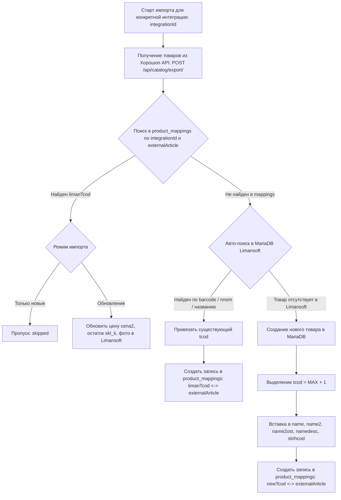

# TASK-22: Импорт каталога из Хорошоп в Limansoft (MariaDB) с привязкой к product_mappings

- **ID:** TASK-22
- **Эпик:** Horoshop Интеграция & Двусторонняя синхронизация
- **Статус:** Planned
- **Приоритет:** High
- **Исполнитель:** Backend & Integration Architect

---

## 🎯 Цель
Разработать надежный, безопасный и масштабируемый механизм обратного импорта каталога товаров из магазина **Хорошоп** в учетную базу данных **Limansoft** (MariaDB: `name2`, `name2ost`, `namedesc`, `strihcod`) с автоматической регистрацией связей в **`product_mappings`** для конкретной **`tenant_integrations`**.

Механизм включает:
- Фоновые очереди BullMQ (`import-horoshop-catalog`) с отслеживанием прогресса 0–100%;
- Распределенные блокировки Redis (`lock:tenant:{tenantId}:sync`) для предотвращения Race Condition;
- Throttling & Batching (пачки по 50–100 SKU, паузы 200мс, до 5 потоков скачивания фото);
- Двухуровневый матчинг (`product_mappings` ➔ штрихкод / артикул `nnom` / название);
- Безопасный режим (Safe Mode: только новые товары) и режим обновления (Overwrite Mode с модалкой подтверждения рисков и авто-бэкапом перед стартом).

---

## 🏗️ Архитектура импорта с учетом мульти-интеграций (Option 2)

---

## 🔍 Алгоритм сопоставления и связывания (Matching Pipeline)

1. **Шаг 1: Проверка в `product_mappings` (O(1))**:
   - Поиск по индексу `(integration_id, external_article)`.
   - Если маппинг найден: товар уже известен нашей системе.

2. **Шаг 2: Авто-матчинг в MariaDB Лимансофт**:
   - Если маппинга ещё нет (например, товар уже был в Лимансофте до подключения интеграции):
     1. По штрихкоду: `strihcod.strih` = `horoshop.barcode` / `gtin`.
     2. По номенклатурному артикулу: `name2.nnom` = `horoshop.article` / `mpn`.
     3. По наименованию: `name2.name` = `horoshop.title.ua`.
   - При совпадении: создаётся запись в таблице `product_mappings` со статусом `synced`.

3. **Шаг 3: Добавление нового товара в Limansoft (если товар уникален)**:
   - Проверка наличия категории в `name` (создание группы, если отсутствует);
   - Выделение `tcod = MAX(tcod) + 1`;
   - Вставка в `name2` (наименование, `nnom = article`, `cena2 = price`);
   - Вставка начального остатка в `name2ost` (`skl_k = quantity`);
   - Скачивание фото по ссылкам из Хорошопа и сохранение BLOB в `namedesc`;
   - Запись штрихкода в `strihcod` (если есть);
   - **Фиксация связи**: вставка в `product_mappings` (`integrationId`, `tenantId`, `limanTcod`, `externalArticle`, `status: 'synced'`).

---

## 🛡️ Безопасность и режимы импорта

1. **Режим «Только новые товары» (Safe Mode — по умолчанию)**:
   - Существующие товары и учётные цены/остатки в Limansoft гарантированно не перезаписываются.
   - Новые товары из Хорошопа бережно заводятся в номенклатуру Лимансофт с автоматическим созданием маппинга.

2. **Режим «Полное обновление» (Overwrite Mode)**:
   - Модальное окно подтверждения рисков с обязательным чекбоксом согласия на замену учётных данных.
   - **Pre-Sync Safety Backup**: автоматическое создание резервной копии MariaDB Лимансофт (`BackupService.createBackup`) перед стартом изменений.

3. **Распределенный Redis Lock**:
   - Ключ `lock:tenant:{tenantId}:sync` исключает конфликт между фоновым импортом каталога, экспортом остатков и приёмом вебхуков.

---

## 📋 План реализации

### 1. Серверная часть (`liman-web-api`)
- [ ] Добавить очередь BullMQ `import-horoshop-catalog` и процессор `HoroshopImportProcessor`.
- [ ] Реализовать метод получения каталога из Хорошоп пачками через `POST /api/catalog/export/`.
- [ ] Реализовать сервис сопоставления и вставки новых товаров в MariaDB с транзакциями:
  - Выделение `tcod`, создание категорий в `name`, запись в `name2`, `name2ost`, `namedesc`, `strihcod`.
- [ ] Автоматическое наполнение таблицы `product_mappings` для `integrationId`.
- [ ] Эндпоинт `POST /api/v1/horoshop/:tenantId/import/catalog`:
  - Параметры: `{ integrationId, mode: 'only_new' | 'overwrite', updatePrices, updateStock, updateImages, createBackup }`.
- [ ] Эндпоинт отслеживания прогресса `GET /api/v1/sync/jobs/import-horoshop-catalog/:jobId`.

### 2. Пользовательский интерфейс (Frontend)
- [ ] Выбор конкретной интеграции/магазина, если у клиента их несколько.
- [ ] Карточка «Импорт товаров из Хорошоп в Limansoft» в кабинете клиента:
  - Выбор режима (только новые / полная синхронизация).
  - Чекбоксы фильтров (цены, остатки, фото, авто-бэкап).
  - Модалка предупреждения рисков (RU / UK).
  - Интерактивный прогресс-бар с показателями: *«Обработано 82 из 82 (Новых: 12, Связано: 70, Ошибок: 0)»*.

---

## 🧪 Критерии приемки
- [ ] Импорт успешно выкачивает каталог тестового магазина `shop724088.horoshop.ua`.
- [ ] Создаются записи в `product_mappings` для каждой импортированной позиции.
- [ ] При повторном запуске в режиме "только новые" дубликаты не создаются.
- [ ] Цены и остатки в MariaDB Limansoft обновляются только при явном выборе соответствующего режима.
- [ ] Все тесты бэкенда и фронтенда проходят успешно.
