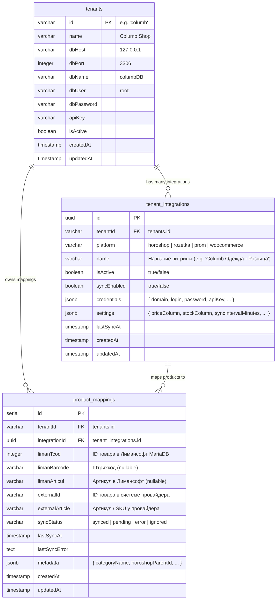

# TASK-28: Миграция Master БД на PostgreSQL и архитектура сопоставления товаров (tenant_integrations + product_mappings)

- **ID:** TASK-28
- **Эпик:** Database Architecture & Multi-Platform Catalog Sync
- **Статус:** In Progress
- **Приоритет:** Highest
- **Исполнитель:** Backend & Integration Architect

---

## 🎯 Цели задачи

1. **Миграция внутренней Master БД с SQLite на PostgreSQL**:
   - Перевод базы метаданных тенантов, настроек и секретов с SQLite на надежный PostgreSQL.
   - Учет сетевой конфигурации: внешний порт контейнера PostgreSQL на хосте — **`5433:5432`** (порт `5432` занят существующим контейнером `restaurant_db`).
   - Автоматический перенос существующих данных из `./data/liman_master.sqlite` в PostgreSQL при первом старте.

2. **Внедрение архитектуры нескольких интеграций на одного тенанта (Option 2)**:
   - Создание сущности и таблицы **`tenant_integrations`**:
     - У одного тенанта может быть несколько подключений: 2 магазина Хорошоп (розничный и оптовый), Prom.ua, Rozetka, WooCommerce.
     - Хранение API-доступов (`credentials`), специфических настроек (`settings`), статуса активности (`isActive`) и расписания синхронизации.
   - Создание сущности и таблицы **`product_mappings`**:
     - Связывание `limanTcod` (ID товара в MariaDB Лимансофт) с конкретной интеграцией (`integrationId`) и внешним артикулом (`externalArticle` в Хорошопе/маркетплейсе).
     - Уникальные составные B-tree индексы `(integration_id, liman_tcod)` и `(integration_id, external_article)` для поиска за O(1).
     - База данных Лимансофт (MariaDB) остается полностью нетронутой: никаких изменений в схему учетной системы клиента не вносится.

3. **Корректный экспорт и сопоставление товаров в Хорошоп**:
   - Формирование полного пакета при создании товара (`article`, `title: { ua: name }`, `parent: category`, `price`, `quantity`, `presence`).
   - Сохранение созданных связей в `product_mappings`.
   - Детальный парсинг логов ответа Хорошопа (`response.log`) с подсчетом `added`, `updated`, `failed`.

---

## 🏗️ Схема базы данных (PostgreSQL)

---

## 📋 План реализации

### 1. Инфраструктура
- [ ] Добавить сервис `postgres` (`postgres:16-alpine`, порт `5433:5432`, db `liman_master`, volume `postgres_data`) в `docker-compose.yml`.
- [ ] Добавить переменные окружения PostgreSQL в `.env`.
- [ ] Установить драйвер `pg` и `@types/pg`.
- [ ] Запустить контейнер `liman_postgres` на порту `5433`.

### 2. Бэкенд и сущности
- [ ] Создать сущность `TenantIntegration` (`tenant-integration.entity.ts`).
- [ ] Создать сущность `ProductMapping` (`product-mapping.entity.ts`).
- [ ] Переключить конфигурацию `TypeOrmModule` в `app.module.ts` на PostgreSQL с поддержкой `DB_TYPE=sqlite` для тестов.
- [ ] Разработать сервис автомиграции из SQLite (`sqlite-to-postgres-migration.service.ts`):
  - Перенос тенанта `columb` из SQLite.
  - Автоматическое создание первой записи в `tenant_integrations` (платформа `horoshop`, перенос домена `shop724088.horoshop.ua`, логина и пароля).
- [ ] Разработать `ProductMappingService` для CRUD-операций сопоставления и авто-матчинга.

### 3. Экспорт каталога и синхронизация
- [ ] Обновить `HoroshopExportService` и `HoroshopApiClient`:
  - Использование `ProductMappingService` при экспорте.
  - Отправка полных данных для новых товаров (`article`, `title`, `parent`, `price`, `quantity`, `presence`).
  - Сохранение маппинга после успешного добавления.
  - Разбор `response.log` с кодами `0` (успех) и `7` (ошибка) и передача детальной статистики.

---

## 🧪 Критерии приемки
- [ ] PostgreSQL запущен в Docker на порту `5433` и доступен для сервиса `liman-web-api`.
- [ ] Таблицы `tenants`, `tenant_integrations`, `product_mappings` успешно инициализированы в PostgreSQL.
- [ ] Данные тенанта `columb` и его интеграция с Хорошопом перенесены из SQLite в Postgres.
- [ ] Все 20 наборов backend-тестов и 7 наборов frontend-тестов проходят без ошибок.
- [ ] Эндпоинт `GET /api/v1/horoshop/:tenantId/ping` возвращает `ok: true`.
