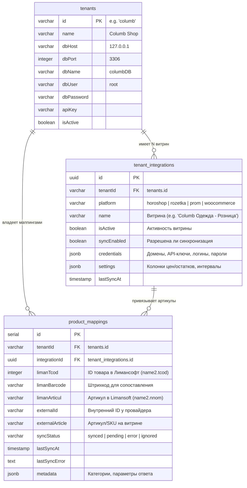
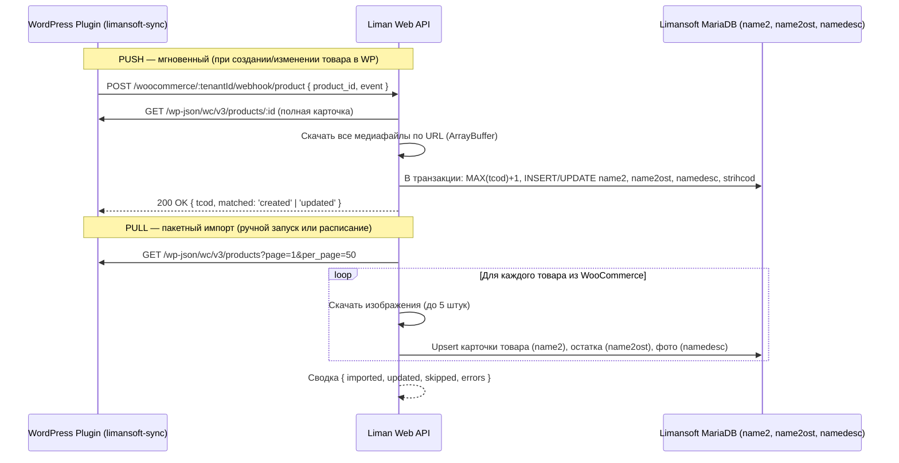

# Техническое руководство: Как устроен и работает Liman Web API

**Liman Web API** — это высокопроизводительный мультитенантный микросервис интеграции учетных баз данных **Limansoft** (MariaDB / MySQL) с внешними платформами электронной коммерции (**WooCommerce**, **Rozetka**, **Prom.ua**, **Хорошоп**).

В этом документе подробно описаны архитектура, внутренние процессы, потоки данных (Data Flow), механизмы синхронизации и специфика работы с legacy-базами Limansoft.

---

## 📑 Содержание

1. [Архитектурный обзор и назначение](#1-архитектурный-обзор-и-назначение)
2. [Data Access Layer: Как устроена база Limansoft](#2-data-access-layer-как-устроена-база-limansoft)
3. [Мультиарендность (Multi-Tenancy) и Connection Manager](#3-мультиарендность-multi-tenancy-и-connection-manager)
   - [Как устроен и работает пул соединений (mysql.createPool)](#31-как-устроен-и-работает-пул-соединений-mysqlcreatepool)
   - [Разделение клиентов: WooCommerce vs Rozetka](#32-разделение-клиентов-woocommerce-vs-rozetka)
   - [Как клиенты обновляются и синхронизируются](#33-как-клиенты-обновляются-и-синхронизируются)
   - [Архитектура мульти-интеграций (Multi-Store) и сопоставление товаров (ProductMapping)](#34-архитектура-мульти-интеграций-multi-store-и-сопоставление-товаров-productmapping)
4. [Стриминг медиа: BLOB в HTTP URL](#4-стриминг-медиа-blob-в-http-url)
5. [Синхронизация каталогов (Outbound Sync)](#5-синхронизация-каталогов-outbound-sync)
   - [WooCommerce (REST API, Unified WP Plugin v2.0.0 & Two-Way Sync)](#51-woocommerce-rest-api--wp-plugin)
     - [Двусторонний импорт каталога (WooCommerce ➔ Limansoft / Two-Way Sync)](#511-двусторонний-импорт-каталога-woocommerce--limansoft--two-way-sync)
     - [Обработка входящих заказов WooCommerce через Unified Order Engine (TASK-31)](#512-обработка-входящих-заказов-woocommerce-через-unified-order-engine-task-31)
   - [Rozetka Marketplace (YML Feed + Seller API)](#52-rozetka-marketplace-yml-feed--seller-api)
   - [Prom.ua (Потоковый XML/YML фид)](#53-promua-потоковый-xmlyml-фид)
   - [Хорошоп (Гибридная схема, Шедулер, Двусторонний импорт и Прямой экспорт)](#54-хорошоп-гибридная-схема-шедулер-и-двусторонний-импорт)
     - [Двусторонний импорт каталога (Хорошоп ➔ Limansoft / Two-Way Sync / TASK-22)](#541-двусторонний-импорт-каталога-хорошоп--limansoft--two-way-sync--task-22)
     - [Прямой экспорт каталога в 1 клик и динамическое название магазина (Limansoft ➔ Хорошоп / TASK-26)](#542-прямой-экспорт-каталога-в-1-клик-и-динамическое-название-магазина-limansoft--хорошоп--task-26)
     - [Обработка заказов Хорошоп: вебхуки, опрос и расследование причин сбоя (TASK-29)](#543-обработка-заказов-хорошоп-вебхуки-опрос-и-расследование-причин-сбоя-task-29)
6. [Единый изолированный движок обработки заказов и списания остатков (LimanOrderService)](#6-единый-изолированный-движок-обработки-заказов-и-списания-остатков-limanorderservice)
   - [6.1 Архитектурная концепция: Single Domain Engine & Anti-Corruption Layer (ACL)](#61-архитектурная-концепция-single-domain-engine--anti-corruption-layer-acl)
   - [6.2 Универсальный резолвер товаров (resolveProductTcod)](#62-универсальный-резолвер-товаров-resolveproducttcod)
   - [6.3 Двухуровневая модель безопасности для десктопного Лимана](#63-двухуровневая-модель-безопасности-для-десктопного-лимана)
   - [6.4 Пять гарантий безопасности при создании документов в MariaDB](#64-пять-гарантий-безопасности-при-создании-документов-в-mariadb)
   - [6.5 Обработка краевых кейсов (Edge Cases & Fault Tolerance)](#65-обработка-краевых-кейсов-edge-cases--fault-tolerance)
   - [6.6 Защита от повторной обработки (Idempotency & Deduplication)](#66-защита-от-повторной-обработки-idempotency--deduplication)
7. [Очереди и асинхронные задачи (BullMQ + Redis)](#7-очереди-и-асинхронные-задачи-bullmq--redis)
   - [7.1 Зачем нужны очереди и как устроен конвейер](#71-зачем-нужны-очереди-и-как-устроен-конвейер)
   - [7.2 Реестр очередей системы](#72-реестр-очередей-системы)
   - [7.3 Монитор очередей в панели Супер-Админа](#73-монитор-очередей-в-панели-супер-админа-admin-queue-monitor)
8. [Резервное копирование и откат БД Limansoft (Backup & Disaster Recovery)](#8-резервное-копирование-и-откат-бд-limansoft-backup--disaster-recovery)
   - [8.1 Назначение и архитектура BackupModule](#81-назначение-и-архитектура-backupmodule)
   - [8.2 Режимы: Fast (каталог) vs Full (полный дамп с медиа BLOB)](#82-режимы-fast-каталог-vs-full-полный-дамп-с-медиа-blob)
   - [8.3 Распределенная блокировка (Redis Distributed Lock)](#83-распределенная-блокировка-redis-distributed-lock)
   - [8.4 Потоковая компрессия Gzip и контроль целостности SHA-256](#84-потоковая-компрессия-gzip-и-контроль-целостности-sha-256)
   - [8.5 Автоматическая ротация (Retention Policy)](#85-автоматическая-ротация-retention-policy)
   - [8.6 REST API резервного копирования](#86-rest-api-резервного-копирования)
9. [Веб-интерфейс и архитектура раздачи статики (React SPA + Nginx)](#9-веб-интерфейс-и-архитектура-раздачи-статики-react-spa--nginx)
   - [9.1 Разделение обязанностей (Nginx vs NestJS)](#91-разделение-обязанностей-nginx-vs-nestjs)
   - [9.2 Трехуровневая инфраструктура Docker Compose](#92-трехуровневая-инфраструктура-docker-compose)
   - [9.3 Фронтенд React SPA: Стек и архитектура](#93-фронтенд-react-spa-стек-и-архитектура)
     - [9.3.1 Панель Супер-Администратора (All-Tenants Master Grid)](#931-панель-супер-администратора-superadmin)
     - [9.3.2 Кабинет Клиента (Client Portal & Action Hub)](#932-кабинет-клиента-client-portal-portaltenantid)
   - [9.4 Интернационализация (i18n): RU / UK](#94-интернационализация-i18n-ru--uk)
   - [9.5 Аутентификация, Magic Links и перехватчик Axios](#95-аутентификация-magic-links-и-перехватчик-axios)
10. [Безопасность и жизненный цикл запроса](#10-безопасность-и-жизненный-цикл-запроса)
11. [Сводная таблица соответствия сущностей](#11-сводная-таблица-соответствия-сущностей)
12. [Справочник основных REST API эндпоинтов](#12-справочник-основных-rest-api-эндпоинтов)
13. [Продакшн-развертывание на Hetzner и CI/CD GitHub Actions (TASK-30)](#13-продакшн-развертывание-на-hetzner-и-cicd-github-actions-task-30)
    - [13.1 Архитектура сосуществования с Restaurantify на одном сервере](#131-архитектура-сосуществования-с-restaurantify-на-одном-сервере)
    - [13.2 Непрерывная интеграция и доставка (GitHub Actions CI/CD)](#132-непрерывная-интеграция-и-доставка-github-actions-cicd)
    - [13.3 Скрипт безопасного развертывания deploy.sh и Healthcheck](#133-скрипт-безопасного-развертывания-deploysh-и-healthcheck)
    - [13.4 Пошаговая инструкция настройки сервера Hetzner и секретов GitHub](#134-пошаговая-инструкция-настройки-сервера-hetzner-и-секретов-github)
    - [13.5 Процедура экстренного отката (Emergency Rollback)](#135-процедура-экстренного-отката-emergency-rollback)

---

## 1. Архитектурный обзор и назначение

### Проблема, которую решает сервис
Учетная система **Limansoft** — это локальная Windows-программа с базой данных MariaDB/MySQL. Её структура создавалась для работы внутри розничных магазинов и оптовых складов. У неё есть особенности:
- Товары идентифицируются внутренним числовым кодом `tcod`.
- Фотографии хранятся непосредственно в таблице `namedesc` как бинарные блобы (`LONGBLOB`), а не в виде веб-ссылок.
- Цены хранятся в 31 отдельной колонке (`cena1`...`cena31`), а остатки разделены по складам (`skl_k`, `skl_kt` и др.).
- Современные маркетплейсы требуют открытых HTTP REST API, вебхуков, потоковых фидов и публичных URL к изображениям.

**Liman Web API** выступает интеллектуальным шлюзом, который транслирует запросы маркетплейсов в оптимизированные SQL-запросы к MariaDB и обратно, защищает базы клиентов с помощью распределенных блокировок и резервных копий, а также предоставляет удобный мультиязычный веб-интерфейс (SPA) для администраторов и клиентов.

### Общая архитектурная схема

```
┌───────────────────────────────────────────────────────────────────────────────────────────┐
│                                ПОЛЬЗОВАТЕЛИ И ВНЕШНИЕ СЕРВИСЫ                             │
│                                                                                           │
│   Браузеры пользователей (SPA)            Маркетплейсы и витрины электронной коммерции    │
│   ┌─────────────────────────────┐         ┌─────────────┐ ┌──────────┐ ┌────────┐ ┌─────┐ │
│   │ SuperAdmin / Client Portal  │         │ WooCommerce │ │ Rozetka  │ │Prom.ua │ │Хоро-│ │
│   │ RU / UK (React 19 + Vite 8) │         │ (WP Plugin) │ │Seller API│ │YML Feed│ │шоп  │ │
│   └──────────────┬──────────────┘         └──────┬──────┘ └────┬─────┘ └───┬────┘ └──┬──┘ │
└──────────────────┼───────────────────────────────┼─────────────┼───────────┼─────────┼────┘
                   │                               │             │           │         │
                   ▼                               ▼             ▼           ▼         ▼
┌───────────────────────────────────────────────────────────────────────────────────────────┐
│                                NGINX REVERSE PROXY & STATIC                               │
│                                                                                           │
│   Порт 80:                                                                                │
│   - Раздача статики SPA (try_files $uri $uri/ /index.html) из ./public/app                │
│   - Кэширование ассетов (expires 1y, Cache-Control: public, immutable) + gzip             │
│   - Проксирование API: location /api/ -> proxy_pass http://nestjs:3000                    │
└───────────────────────────────────────────────┬───────────────────────────────────────────┘
                                                │
                                                ▼
┌───────────────────────────────────────────────────────────────────────────────────────────┐
│                               LIMAN WEB API (NestJS Core)                                 │
│                                                                                           │
│ ┌───────────────────────────────────────────────────────────────────────────────────────┐ │
│ │                             Слой безопасности и роутинга                              │ │
│ │  ApiKeyGuard (x-api-key / IDOR) │ Public Endpoints (@Public) │ Helmet │ Throttler     │ │
│ └──────────────────────────────────────────┬────────────────────────────────────────────┘ │
│                                            │                                              │
│ ┌──────────────────────────────────────────▼────────────────────────────────────────────┐ │
│ │                                  Бизнес-модули API                                    │ │
│ │  WoocommerceModule │ RozetkaModule │ PromModule │ HoroshopModule │ MediaModule (BLOB) │ │
│ │  TenantModule      │ BackupModule  │ QueueModule (BullMQ Worker)                      │ │
│ └─────────────────────┬────────────────────┬──────────────────────────────────┬─────────┘ │
│                       │                    │                                  │           │
│ ┌─────────────────────▼──────┐  ┌──────────▼──────────────┐  ┌────────────────▼─────────┐ │
│ │    TenantConnectionManager │  │    Redis 7 Distributed  │  │    Local Filesystem      │ │
│ │    Динамические пулы к     │  │    Locks & BullMQ Queue │  │    (data/backups/ &      │ │
│ │    MariaDB каждого тенанта │  │    lock:tenant:{id}:busy│  │     data/tenants.sqlite) │ │
│ └─────────────────────┬──────┘  └─────────────────────────┘  └──────────────────────────┘ │
└───────────────────────┼───────────────────────────────────────────────────────────────────┘
                        │
                        ▼
┌───────────────────────────────────────────────────────────────────────────────────────────┐
│                             БАЗЫ ДАННЫХ LIMANSOFT (MariaDB)                               │
│                                                                                           │
│   ┌──────────┐     ┌──────────┐     ┌──────────┐     ┌──────────┐     ┌───────────────┐   │
│   │  name2   │     │ name2ost │     │ namedesc │     │   name   │     │   strihcod    │   │
│   │  Товары  │     │ Остатки  │     │ BLOB Фото│     │Категории │     │  Штрихкоды    │   │
│   └──────────┘     └──────────┘     └──────────┘     └──────────┘     └───────────────┘   │
└───────────────────────────────────────────────────────────────────────────────────────────┘
```

---

## 2. Data Access Layer: Как устроена база Limansoft

Сервис работает напрямую с реляционными таблицами MariaDB. Ниже приведено назначение каждой таблицы:

### 1. Таблица `name2` — Каталог товаров
Основная карточка товара.
- `tcod` *(int, PK)* — уникальный внутренний код товара в Limansoft. Именно он используется во всех интеграциях как **SKU** (WooCommerce) или **Article / External ID** (Rozetka, Prom, Хорошоп).
- `name` *(varchar)* — наименование товара.
- `group` *(varchar)* — код категории товара (соответствует таблице `name.group`).
- `nnom` *(varchar)* — основной артикул или штрихкод.
- `cena1` ... `cena31` *(decimal)* — колонки цен. Например, `cena1` — себестоимость/закупка, `cena2` — стандартная розничная цена.
- `producer` *(varchar)* — производитель / бренд товара.
- `vid` *(int)* — флаг типа записи (`vid = 0` — активный товар, `vid = 1` — услуга или удаленный товар). Сервис фильтрует товары условием `vid = 0`.

### 2. Таблица `name2ost` — Складские остатки
Остатки товаров в разрезе складов и торговых точек.
- `tcod` *(int, PK)* — связь с `name2.tcod`.
- `skl_k` *(decimal)* — остаток на центральном складе (колонка по умолчанию).
- `skl_kt`, `skl_r` и др. — остатки по дополнительным торговым точкам.

### 3. Таблица `namedesc` — Описания и изображения (BLOB)
- `tcod` *(int, PK)* — код товара.
- `descrip` *(text/mediumblob)* — текстовое описание товара (часто с HTML-разметкой).
- `photo1`, `photo2` ... `photo5` *(longblob)* — бинарные данные фотографий товара.

### 4. Таблица `name` — Иерархия категорий
- `group` *(char(10), PK)* — строковый код группы (например, корневые `'01'`, `'30'` или дочерние `'0103'`, `'300101'`).
- `name_g` *(char(50))* — название категории.
- `parent` *(char(10))* — код родительской группы (`''` для корневых узлов) для построения дерева каталога.
- `group_t`, `stat`, `proc1`..`proc4`, `cena`, `cena_z` — системные служебные поля Limansoft, автоматически заполняемые при автосоздании категорий сервисом `LimanService.resolveCategoryGroup`.

### 5. Таблица `strihcod` — Дополнительные штрихкоды
- У одного товара (`tcod`) может быть несколько штрихкодов (от разных упаковок, весовые и т.д.). Таблица связывает `tcod` и штрихкоды `barcode`.

### 6. Таблица `nshap` — Шапка документов и накладных
Регистр всех первичных торговых документов (приходы, расходы, чеки, заказы):
- `count` *(int, PK)* — глобальный сквозной уникальный идентификатор документа.
- `n_dok` *(double/int)* — номер документа в пределах своего типа (извлекается из счетчика `ndok`).
- `date` *(date)* — дата документа.
- `tip_dok` *(smallint)* — тип документа:
  - `tip_dok = 1` — приходная накладная;
  - `tip_dok = 2` — расходная накладная (отгрузка с автоматическим списанием склада);
  - `tip_dok = 30` — кассовый розничный чек;
  - `tip_dok = 85` — **Заказ покупателя / Резерв / Счет** (используется для входящих заказов из интернет-магазинов).
- `kklient` *(int)* — ID контрагента из таблицы `klient` (для розничных интернет-заказов связывается с системным `kklient: 2` — «конечный потребитель»).
- `klient` *(char(40))* — отображаемое текстовое имя клиента.
- `summa` *(double)* — общая сумма документа.
- `prov` *(enum('f','t'))* — статус проведения документа (`'f'` — черновик/не проведен, `'t'` — проведен в учетном регистре).
- `prim` *(char(80))* — краткое примечание (фиксирует источник и номер: `[Хорошоп Заказ #1]·Безналичный расчет`).
- `fullprim` *(char(200))* — расширенное примечание (ФИО клиента, телефон, адрес доставки Новой Почты).

### 7. Таблица `nakltelo` — Строки и товарные позиции документов
Содержимое корзины конкретного документа:
- `index` *(int, PK)* — глобальный автоинкрементный номер строки.
- `count` *(int, FK)* — связь с шапкой документа `nshap.count`.
- `tcod` *(int)* — код товара (`name2.tcod`).
- `name` *(char(100))* — наименование товара на момент продажи.
- `kol` *(double)* — количество единиц товара.
- `cena` *(double)* — отпускная цена единицы товара.
- `nnom` *(char(20))* — артикул товара.
- `group` *(char(10))* — код категории товара.

### 8. Таблица `ndok` — Системные счетчики номеров документов
Хранилище следующих доступных номеров документов для исключения коллизий в кассовой программе:
- `flt5` *(smallint)* — тип документа (`flt5 = 2` для накладных, `flt5 = 85` для заказов покупателей).
- `n_dok` *(double)* — текущий порядковый номер документа.
- При создании заказа извне блокируется транзакцией: `SELECT n_dok FROM ndok WHERE flt5 = 85 FOR UPDATE`.

### 9. Таблица `checkdok` — Реестр связей заказов и документов
Служебная таблица связки документов и кассовых мест:
- `count` *(int)* — связь с `nshap.count`.
- `tip_dok` *(smallint)* — тип документа (`85`).
- `n_dok` *(double)* — номер документа.
- `kklient` *(int)* — контрагент.

### 10. Таблица `dmonitor` — Журнал аудита действий (Audit Log)
Журнал безопасности и сменной отчетности кассиров:
- `date`, `time` — штамп времени события.
- `uname` *(char(30))* — имя оператора (для веб-заказов: `'WEB-API (Хорошоп)'`, `'WEB-API (WooCommerce)'`).
- `mname` *(char(30))* — имя рабочей станции (`'SERVER'`).
- `n_mach` *(smallint)* — номер виртуальной кассы (`99`).
- `count` *(int)* — номер документа `nshap.count`.
- `action` *(char(20))* — действие (`'Заказ'`, `'Новый'`).

---

## 3. Мультиарендность (Multi-Tenancy) и Connection Manager

Сервис построен по архитектурной модели **Database-per-Tenant** с динамической маршрутизацией подключений (**Logical Multi-Tenancy**). У каждого клиента своя независимая база данных Limansoft (MariaDB / MySQL), часто развернутая на собственном сервере магазина или локальном компьютере с белым IP.

```
┌────────────────────────────────────────────────────────────────────────┐
│             Liman Web API (Единое ядро приложения)                     │
│                                                                        │
│   Мастер-БД PostgreSQL 16 (liman_postgres :5433)                      │
│   ┌────────────────────────────────────────────────────────────────┐   │
│   │ tenants: id: "columb", dbHost: 127.0.0.1, dbName: columbDB     │   │
│   │ tenant_integrations: Horoshop 1, Horoshop 2, Prom, Rozetka     │   │
│   │ product_mappings: limanTcod <-> externalArticle (O(1) B-tree)   │   │
│   └────────────────────────────────────────────────────────────────┘   │
└───────────────┬────────────────────────────────────────┬───────────────┘
                │                                        │
        Запрос к /columb                         Запрос к /client-b
                │                                        │
        ┌───────▼────────┐                       ┌───────▼────────┐
        │  Пул коннектов │                       │  Пул коннектов │
        │     КЛИЕНТ А   │                       │    КЛИЕНТ Б    │
        └───────┬────────┘                       └───────┬────────┘
                │                                        │
    ┌───────────▼───────────┐                ┌───────────▼───────────┐
    │ MariaDB 1 (Клиент А)  │                │ MariaDB 2 (Клиент Б)  │
    │ База: columbDB        │                │ База: client_b_db     │
    └───────────┬───────────┘                └───────────┬───────────┘
                │                                        │
        Синхронизация                            Синхронизация
                │                                        │
    ┌───────────▼───────────┐                ┌───────────▼───────────┐
    │ Магазины: Хорошоп 1,2 │                │ Маркетплейс Rozetka   │
    │ Prom.ua, WooCommerce  │                │ (api-seller.rozetka)  │
    └───────────────────────┘                └───────────────────────┘
```

---

### 3.1 Как устроен и работает пул соединений (`mysql.createPool`)

Создание и кэширование пулов инкапсулировано в классе `TenantConnectionManager`:

```typescript
const pool = mysql.createPool({
  host: tenant.dbHost,
  port: tenant.dbPort,
  user: tenant.dbUser,
  password: tenant.dbPassword,
  database: tenant.dbName,
  waitForConnections: true,
  connectionLimit: 10,
  queueLimit: 0,
  enableKeepAlive: true,
  keepAliveInitialDelay: 10000,
  timezone: '+00:00',
});
```

#### Зачем нужен пул (Pool vs Single Connection)
- **Без пула**: каждый входящий HTTP-запрос открывает новый TCP-сокет к MariaDB, делает TLS/SSL рукопожатие, проходит аутентификацию пользователя, выполняет SQL и закрывает соединение. Это занимает 20–100+ мс накладных расходов на каждый запрос и быстро приводит к ошибке MariaDB `Too many connections`.
- **С пулом**: приложение держит готовую переиспользуемую «обойму» активных постоянных соединений (Persistent Connections). Запрос мгновенно берёт свободное соединение из пула, выполняет SQL и возвращает его обратно (`connection.release()`).

#### Назначение параметров конфигурации:
1. **`connectionLimit: 10`**:
   - Максимальное число физических TCP-соединений к MariaDB конкретного клиента.
   - Защищает базу магазина от перегрузки: если на витрину клиента одновременно придет 200 пользователей, сервис не откроет 200 тяжелых коннектов к базе, а ограничит параллелизм 10 потоками.
2. **`waitForConnections: true`**:
   - Если все 10 соединений в данный момент заняты выполнением запросов, 11-й запрос **не падает с ошибкой**, а становится в очередь ожидания первого освободившегося коннекта.
3. **`queueLimit: 0`**:
   - Максимальная глубина очереди ожидания. Значение `0` означает отсутствие лимита очереди (запросы выполняются последовательно по мере освобождения ресурсов пула).
4. **`enableKeepAlive: true` и `keepAliveInitialDelay: 10000`**:
   - Включает TCP Keep-Alive на сокетах соединений.
   - Каждые 10 секунд (10 000 мс) простоя операционная система отправляет проверочный TCP-пакет.
   - Это защищает от «тихого» обрыва неактивных коннектов межсетевыми экранами (Firewall), NAT-маршрутизаторами и тайм-аутами простоя самой MariaDB (`wait_timeout`).
5. **`timezone: '+00:00'`**:
   - Синхронизирует обработку полей даты и времени (`DATETIME`, `TIMESTAMP`) строго в UTC, предотвращая искажения времени создания товаров и заказов при переносе между Node.js и MariaDB.
6. **Lazy-инициализация**:
   - Соединения внутри пула не создаются все 10 сразу. Они открываются по требованию при появлении реальных SQL-запросов и затем остаются прогретыми в оперативной памяти.

---

### 3.2 Разделение клиентов: WooCommerce vs Rozetka

Представим сценарий:
- **Клиент 1 (`shop-a`)**: владелец интернет-магазина на **WooCommerce**. Его учетная база Limansoft расположена на сервере `192.168.1.10:3306/liman_shopA`.
- **Клиент 2 (`shop-b`)**: продавец на маркетплейсе **Rozetka**. Его база Limansoft расположена на сервере `10.0.0.5:3306/liman_shopB`.

Разделение и изоляция обеспечиваются на 4 уровнях:

#### Уровень 1: Реестр тенантов и витрин (Master Database PostgreSQL 16)
В базе PostgreSQL `liman_master` (контейнер `liman_postgres`, хост-порт `5433:5432`) хранятся раздельные конфигурации:
- Таблица `tenants`: реквизиты MariaDB (`dbHost`, `dbPort`, `dbName`, `dbUser`, `dbPassword`), персональный `apiKey`.
- Таблица `tenant_integrations`: отдельные записи для каждого магазина клиента (несколько витрин Хорошоп, Prom, Rozetka, WooCommerce) со своими `credentials` и `settings`.
- Таблица `product_mappings`: сопоставление `liman_tcod` товара учетной системы и внешнего артикула `external_article` для каждой конкретной интеграции.

#### Уровень 2: Изоляция адресного пространства (URL Namespaces)
Все эндпоинты в API строго привязаны к идентификатору клиента `:tenantId`:
- Для Клиента А (WooCommerce):
  - `POST /api/v1/woocommerce/shop-a/sync` — синхронизация цен и остатков.
  - `POST /api/v1/woocommerce/shop-a/webhook/order` — приём заказов WooCommerce.
- Для Клиента Б (Rozetka):
  - `GET  /api/v1/rozetka/shop-b/feed.xml` — персональный XML-каталог Розетки.
  - `POST /api/v1/rozetka/shop-b/sync/prices-stocks` — пакетное обновление цен и остатков (`PUT /items/mass-update`).
  - `POST /api/v1/rozetka/shop-b/sync/orders` — опрос новых заказов Розетки.

#### Уровень 3: Безопасность и авторизация (`ApiKeyGuard`)
Каждый входящий запрос проверяется гардом безопасности:
- Запрос от Клиента А с его заголовком `x-api-key` валидируется исключительно против настроек `shop-a`.
- Клиент А не может вызвать методы или просмотреть фид Клиента Б — запрос с неверным ключом отклоняется со статусом `HTTP 401 / 403`.

#### Уровень 4: Изоляция пулов MariaDB (`TenantConnectionManager`)
Менеджер пулов хранит реестр соединений в `Map<string, Pool>`:
```typescript
getPool(tenant: Tenant): Pool {
  if (this.pools.has(tenant.id)) {
    return this.pools.get(tenant.id)!;
  }
  const pool = mysql.createPool({ ... });
  this.pools.set(tenant.id, pool);
  return pool;
}
```
- Запросы для `shop-a` направляются **только** в пул базы `liman_shopA`.
- Запросы для `shop-b` направляются **только** в пул базы `liman_shopB`.
- Физическое смешение данных невозможно — запросы исполняются в совершенно разных TCP-соединениях к разным базам данных.

---

### 3.3 Как клиенты обновляются и синхронизируются

Процессы синхронизации двух клиентов полностью независимы и могут работать одновременно:

| Сценарий | Клиент А (WooCommerce) | Клиент Б (Rozetka) |
| :--- | :--- | :--- |
| **Выгрузка каталога (Каталог ➔ Витрина)** | `POST /woocommerce/shop-a/sync`<br>Выбирает измененные товары из `liman_shopA` и пушит батчами по 100 товаров через REST API WooCommerce (`/wp-json/wc/v3/products/batch`). | **Фид**: `GET /rozetka/shop-b/feed.xml` скачивается роботом Розетки.<br>**Дельта-синхронизация**: `POST /rozetka/shop-b/sync/prices-stocks` читает остатки из `liman_shopB` и отправляет в Rozetka Seller API через `PUT /items/mass-update`. |
| **Списание остатков при заказе (Витрина ➔ Liman)** | Покупатель оформил заказ в WooCommerce ➔ магазин шлёт webhook на `/woocommerce/shop-a/webhook/order` ➔ сервис выполняет `UPDATE name2ost ...` **строго в базе `liman_shopA`**. | Покупатель оформил заказ на Rozetka ➔ сервис по крону или через `/rozetka/shop-b/sync/orders` забирает новые заказы ➔ выполняет `UPDATE name2ost ...` **строго в базе `liman_shopB`**. |
| **Фоновые задачи (BullMQ + Redis)** | Отдельная очередь/джоба: `{ tenantId: 'shop-a', type: 'woocommerce' }`. | Отдельная очередь/джоба: `{ tenantId: 'shop-b', type: 'rozetka' }`. |

**Результат**: если база данных Клиента А временно недоступна (например, выключен сервер в магазине), Клиент Б продолжает работать, отдавать XML-фид и синхронизировать остатки с Розеткой без малейших задержек или сбоев.

---

### 3.4 Архитектура мульти-интеграций (Multi-Store) и сопоставление товаров (`ProductMapping`)

В рамках масштабирования системы (Option 2) сервис переведён на внутреннюю Master-базу **PostgreSQL 16** (контейнер `liman_postgres`, порт `5433:5432`), что решило задачу подключения **нескольких магазинов к одному клиенту** без внесения каких-либо изменений в учетную базу MariaDB Лимансофт.



#### Ключевые преимущества и механика работы:
1. **Поддержка множества магазинов у одного тенанта (`tenant_integrations`)**:
   - Клиент `columb` может иметь розничный магазин Хорошоп (`shop724088.horoshop.ua`), оптовый магазин Хорошоп (`opt.columb.ua`), магазин на Prom.ua и кабинет продавца Rozetka.
   - Каждая витрина хранит свои собственные реквизиты (`credentials`), флаги вебхуков и настройки цен (`settings`).
2. **Изолированное сопоставление товаров (`product_mappings`)**:
   - Артикулы в разных маркетплейсах могут различаться. Маппинг привязывается к паре `(integrationId, limanTcod)`.
   - **Уникальные B-tree индексы в PostgreSQL**:
     - `(integrationId, limanTcod)` — мгновенный поиск внешнего артикула за $O(1)$ при выгрузке цен и остатков из Лимансофт.
     - `(integrationId, externalArticle)` — мгновенный поиск `tcod` за $O(1)$ при поступлении вебхука заказа из Хорошоп/маркетплейса для списания остатка в MariaDB.
3. **Абсолютная чистота учетной БД MariaDB**:
   - База Limansoft не модифицируется: в неё не добавляются служебные колонки или таблицы интеграций. Все связи хранятся в защищённом PostgreSQL сервиса.
4. **Автоматическая миграция (Zero-Downtime Migration)**:
   - Сервис `SqliteToPostgresMigrationService` при старте автоматически переносит существующих тенантов из legacy SQLite-файла в PostgreSQL и создаёт соответствующие записи витрин в `tenant_integrations`.

---

## 4. Стриминг медиа: BLOB в HTTP URL

Внешние площадки (Prom, Rozetka, WooCommerce) не умеют загружать картинки из базы данных напрямую — им требуются публичные HTTP URL (`.jpg` / `.png`).

Сервис решает эту проблему модулем `MediaModule`:
```http
GET /api/v1/media/:tenantId/products/:tcod/:photoIndex.jpg
```

### Внутренний механизм работы:
1. Запрос поступает в `MediaController`.
2. `LimanService` выполняет точечный SQL-запрос:
   ```sql
   SELECT photo1 FROM namedesc WHERE tcod = ? LIMIT 1
   ```
3. Если бинарный буфер найден:
   - Вычисляется контрольная сумма буфера (MD5 hash) для генерации `ETag`.
   - Проверяется заголовок запроса `If-None-Match`: если хэш совпадает, сервер мгновенно возвращает **HTTP 304 Not Modified** без передачи тела картинки. Это экономит до 90% сетевого трафика.
   - Устанавливаются заголовки `Content-Type: image/jpeg` и `Cache-Control: public, max-age=86400`.
   - Бинарный поток передается клиенту.
4. Если фото отсутствует:
   - Генерируется чистый векторный SVG-плейсхолдер с названием товара и возвращается со статусом `HTTP 200`.

---

## 5. Синхронизация каталогов (Outbound Sync)

Каждая e-commerce платформа имеет свои особенности экспорта каталога:

### 5.1. WooCommerce (REST API + WP Plugin)
- **Идентификация товаров**: SKU в WooCommerce = `tcod` в Limansoft.
- **Пакетная выгрузка (`batchUpsertProducts`)**:
  - Товары отправляются чанками по 50 штук на эндпоинт `/wp-json/wc/v3/products/batch`.
  - Перед отправкой сервис делает предварительный запрос, чтобы проверить, какие SKU уже существуют в WordPress. Товары автоматически разделяются на списки `create` (новые) и `update` (существующие). Это предотвращает ошибку `product_invalid_sku`.
  - Увеличен таймаут HTTP-запроса до 120 секунд для стабильности на медленных хостингах.
- **WordPress плагин нового поколения (`packages/limansoft-sync-woocommerce` v2.0.0)**:
  - Единый консолидированный плагин **Limansoft Sync for WooCommerce** объединил возможности синхронизации через REST API и прямого скоростного доступа к базе данных.
  - **Прямой скоростной драйвер (`LSW_Direct_DB`)**: возможность прямого подключения к базе `columbDB` с автоопределением колонок цен (`cena1`...`cena31`) и остатков (`skl_k`).
  - **Умная группировка товаров (`LSW_Product_Grouper`)**: интеллектуальное объединение простых товаров в вариативные по брендам, вкусам, объемам (мл) и крепости никотина (мг), что критически важно для вейп-шопов и каталогов с множеством модификаций.
  - **Двуязычные карточки товаров**: интеграция с Polylang (UA / RU) для синхронной генерации описаний и атрибутов на обоих языках.
  - **Встроенный Веб-Паук (`LSW_Web_Scraper`)**: автоматический поиск высококачественных фотографий через Bing Images API, загрузка в медиабиблиотеку WordPress, создание WebP-миниатюр и галерей карточек товаров.
  - **Сверхбыстрый мигратор (`LSW_Migrator`)**: синхронизация более 5 900 товаров за 3 секунды с очисткой дубликатов.
  - **Современная адаптивная админка**: сайдбар расширен до 380px, применена гибкая верстка кнопок действий с защитой от выпадения иконок (`.lsw-btn-icon`) и переносом текста (`white-space: normal !important`), консоль живых логов и поддержка WooCommerce HPOS (High-Performance Order Storage).
  - **Планировщик WP-Cron**: настраиваемый интервал (15, 30 или 60 минут). При выключении переключателя задача сразу удаляется из cron, не создавая нагрузки на процессор сервера.

#### 5.1.1. Двусторонний импорт каталога (WooCommerce ➔ Limansoft / Two-Way Sync)

Помимо классической выгрузки каталога из учетной системы на витрину, сервис поддерживает **обратный импорт** товаров, созданных или отредактированных контент-менеджерами непосредственно в WooCommerce (или импортированных из других источников).

##### Архитектура и потоки данных (Data Flow):



##### Ключевые механизмы двустороннего импорта:
1. **Два режима работы:**
   - **PUSH (Event-Driven)**: плагин перехватывает хуки WordPress `woocommerce_new_product` и `woocommerce_update_product` и мгновенно отправляет вебхук `POST /api/v1/woocommerce/:tenantId/webhook/product`. В настройках плагина доступен тумблер (галочка) *"Автоматически передавать новые и измененные товары в Limansoft"*.
   - **PULL (Batch Import)**: вызов `POST /api/v1/woocommerce/:tenantId/import/products` выполняет постраничную загрузку каталога из WooCommerce API и синхронизирует его в учетную базу.
2. **Алгоритм сопоставления (Matching & Deduplication):**
   - Если SKU товара в WooCommerce — целое число (например, `251`), система ищет товар в `name2` по `tcod = 251` и выполняет обновление (`UPDATE`).
   - Если SKU строковый или задан штрихкод, выполняется поиск в `strihcod.nnom`. При нахождении обновляется соответствующий `tcod`.
   - Если товар не найден ни по одному признаку, открывается транзакция с блокировкой `SELECT MAX(tcod) + 1 FROM name2 FOR UPDATE`, генерируется новый атомарный `tcod`, и создается новая запись в `name2`, `name2ost` и `strihcod`.
3. **Загрузка и сохранение изображений:**
   - Из WooCommerce извлекаются все ссылки на изображения (до 5 штук).
   - Сервер асинхронно скачивает бинарные данные по HTTP, валидирует их и сохраняет в BLOB-поля таблицы `namedesc` (`photo`, `photo2`, `photo3`, `photo4`, `photo5`). Благодаря этому кассиры и операторы сразу видят фотографии в десктопном приложении Limansoft.
4. **Защита от зацикливания (Anti-Loop Protection):**
   - Чтобы выгрузка из Limansoft в WooCommerce не вызывала повторный обратный вебхук в Limansoft, при обновлении товаров через API выставляется временный маркер (meta/transient), подавляющий отправку хука плагином.

#### 5.1.2. Обработка входящих заказов WooCommerce через Unified Order Engine (TASK-31)

Входящие заказы из WooCommerce поступают двумя независимыми каналами:
1. **PUSH Webhook (`POST /api/v1/woocommerce/:tenantId/webhook/order`)**:
   - Срабатывает в реальном времени при оформлении заказа в WooCommerce (хуки `woocommerce_new_order` / топики вебхуков `order.created`, `order.updated`).
   - Поддерживает стандартные REST вебхуки WooCommerce, а также HPOS (High-Performance Order Storage).
   - Контроллер выполняет валидацию подписи (HMAC-SHA256) и трансформирует сырой payload заказа в строго типизированный `UnifiedIncomingOrderDto`.
2. **PULL Polling (`POST /api/v1/woocommerce/:tenantId/sync/orders`)**:
   - Фоновый сбор заказов в статусе `processing` / `pending` через WooCommerce REST API (`/wp-json/wc/v3/orders`).
   - Выступает надежным страховочным механизмом на случай потери вебхука из-за сетевых сбоев хостинга WordPress.

##### Маппинг данных из WooCommerce в UnifiedIncomingOrderDto:
```typescript
{
  orderId: String(wcOrder.id),
  source: 'woocommerce',
  customer: {
    name: `${wcOrder.billing?.first_name || ''} ${wcOrder.billing?.last_name || ''}`.trim() || 'Покупатель WooCommerce',
    phone: wcOrder.billing?.phone || '',
    email: wcOrder.billing?.email || '',
  },
  delivery: {
    operator: wcOrder.shipping_lines?.[0]?.method_title || 'Доставка',
    city: wcOrder.shipping?.city || wcOrder.billing?.city || '',
    address: [wcOrder.shipping?.address_1, wcOrder.shipping?.address_2].filter(Boolean).join(', '),
  },
  payment: {
    type: wcOrder.payment_method_title || wcOrder.payment_method || 'Онлайн',
    totalSum: parseFloat(wcOrder.total) || 0,
    currency: wcOrder.currency || 'UAH',
  },
  items: wcOrder.line_items.map((li) => ({
    article: li.sku || String(li.product_id),
    name: li.name,
    quantity: li.quantity,
    price: parseFloat(li.price) || 0,
  })),
  createDocument: tenant.woocommerceCreateOrderDocumentEnabled ?? false,
}
```

Все заказы передаются в `LimanOrderService.processIncomingOrder(tenant, unifiedDto)`. В зависимости от статуса радиокнопки/тумблера `woocommerceCreateOrderDocumentEnabled` (по умолчанию выключен, экспериментальный), выполняется либо мгновенный безопасный декремент остатка `name2ost.skl_k`, либо создание полноценного черновика документа `tip_dok: 85`.

### 5.2. Rozetka Marketplace (YML Feed + Seller API)
- **Потоковый фид (`feed.xml`)**:
  - Rozetka требует строгий формат YML (Yandex Market Language) со специфическими тегами: `<vendorCode>`, `<picture>`, `<param name="Кількість">`.
  - Фид генерируется в потоковом режиме частями по 200 товаров прямо в Express Response Stream, удерживая потребление RAM на уровне нескольких мегабайт даже при 50 000 товаров.
- **Rozetka Seller API**:
  - Модуль `RozetkaAuthService` авторизуется через `POST /api/auth` по логину и паролю продавца, получая JWT токен.
  - Токен кэшируется в памяти.
  - Метод `syncPricesAndStocks` отправляет обновления цен и остатков батчами по 100 товаров непосредственно в Seller API.

### 5.3. Prom.ua (Потоковый XML/YML фид)
- Эндпоинт `/api/v1/prom/:tenantId/feed.xml` отдает потоковый YML фид.
- Описания товаров оборачиваются в секции `<![CDATA[...]]>`.
- Иерархия категорий строится по дереву таблицы `name`.

### 5.4. Хорошоп (Гибридная схема, Шедулер и Двусторонний импорт)

Платформа Хорошоп (Cartum) поддерживает **гибридный подход** взаимодействия с учетной системой:
1. **Прямой экспорт каталога в 1 клик (`POST /api/v1/horoshop/:tenantId/export/catalog`)**:
   - Позволяет выгрузить каталог товаров напрямую из MariaDB Лимансофт в Хорошоп без необходимости вручную копировать URL фида и настраивать расписание.
   - Для новых товаров передаются обязательные для Хорошопа поля: `article` (SKU/tcod), `title: { ua: name }`, `parent: category` (создание или сопоставление по дереву `name.group`), `price`, `quantity`, `presence`, `images`, `description`.
   - Успешно созданные и обновленные связи автоматически регистрируются в таблице `product_mappings`.
   - Детальный парсинг логов ответа Хорошопа (`response.log`) с подсчетом `added`, `updated`, `failed` и кодов валидации.
2. **Потоковый XML-фид (`GET /api/v1/horoshop/:tenantId/feed.xml`)**:
   - Альтернативный способ: Хорошоп забирает каталог по расписанию (раз в 2–4 часа), создавая новые карточки товаров, описания, картинки и дерево категорий.
3. **Пакетная синхронизация цен и остатков (REST API `/api/catalog/import/`)**:
   - Быстрый пуш остатков (`remains`/`stock_quantity`) и цен (`price`/`price_old`) порциями по 100 товаров.
   - **Асинхронный режим через BullMQ (`POST /api/v1/horoshop/:tenantId/sync/prices-stocks?async=true`)**:
     При больших каталогах (5 768+ позиций) операция выносится в фоновую очередь `sync-stock`. Клиент сразу получает `jobId`, а в Личном Кабинете отображается живой анимированный прогресс-бар (0–100%) с бейджами состояния очереди. Это гарантирует отсутствие 504 Gateway Timeout от веб-сервера.
4. **Управление вебхуками (Webhooks Control)**:
   - **Вебхук списания остатков при покупке (`POST /api/v1/horoshop/:tenantId/webhook/order`)**: при оформлении заказа в магазине Хорошоп хук мгновенно списывает остаток в MariaDB Лимансофт (`UPDATE name2ost ...`). Включается тумблером `horoshopOrderWebhookEnabled` (по умолчанию активен).
   - **Вебхук создания/модификации товара (`POST /api/v1/horoshop/:tenantId/webhook/product`)**: принимает события добавления товара контент-менеджером на сайте Хорошоп, фиксирует активность и сопоставляет артикул. Включается тумблером `horoshopProductCreationWebhookEnabled`.
   - В Кабинете Клиента ([ClientPortalPage.tsx](file:///Users/bedrosenator/Work/liman-web-api/client/src/pages/ClientPortalPage.tsx)) выведены удобные переключатели и готовые URL для вставки в вебхуки панели Хорошопа.
5. **Автономный фоновый планировщик (`HoroshopSchedulerService`)**:
   - Работает на базе `@nestjs/schedule` в фоновом режиме сервиса.
   - **Каждые 60 секунд** сканирует всех тенантов с настроенным доступом к Хорошоп.
   - Если включена автосинхронизация (`horoshopExportEnabled = true`) и наступило время интервала (`horoshopSyncIntervalMinutes`: 15, 30 или 60 минут), шедулер автоматически ставит задачу в очередь `sync-stock` (`targetPlatform: 'horoshop'`).
   - **Каждые 15 минут** шедулер опрашивает новые заказы в статусе `new` (`pollOrdersAndDeductStock`) и автоматически списывает складские остатки в MariaDB Limansoft, фиксируя события в Activity Feed.
6. **MOCK-режим (Sandbox)**:
   - Если в поле домена указано `mock.horoshop.ua`, API включает встроенную симуляцию ответов (успешная авторизация, генерация заказов и импорт каталога) для сквозного тестирования без привязки к боевому магазину.

#### 5.4.1. Двусторонний импорт каталога (Хорошоп ➔ Limansoft / Two-Way Sync / TASK-22)

Позволяет перенести каталог товаров из витрины Хорошоп (Cartum) напрямую в учетную базу данных Limansoft (MariaDB). Это необходимо при первичном подключении (когда магазин уже наполнен в Хорошоп) или для синхронизации описаний, цен и фото.

```
┌────────────────────────────────────────────────────────────────────────────────────────┐
│                        ПОТОК ДВУСТОРОННЕГО ИМПОРТА ХОРОШОП ➔ LIMANSOFT                 │
│                                                                                        │
│  1. Веб-интерфейс / API              2. NestJS HoroshopImportProcessor 3. MariaDB      │
│  ┌───────────────────────┐           ┌───────────────────────────┐     ┌─────────────┐ │
│  │ Запрос импорта:       │           │ 1. REDIS MUTEX LOCK       │     │             │ │
│  │ - mode: only_new      │──────────>│    lock:tenant:{id}:busy  │     │             │ │
│  │   или overwrite       │           │ 2. AUTO-BACKUP            │     │             │ │
│  │ - confirm_risk: true  │           │    Fast-дамп перед стартом│────>│ data/backups│ │
│  │ - granular toggles    │           │                           │     │             │ │
│  └───────────────────────┘           │ 3. ВЫГРУЗКА ИЗ ХОРОШОП    │     │             │ │
│                                      │    exportCatalog()        │     │             │ │
│                                      │    батчи по 100 товаров   │     │             │ │
│                                      └─────────────┬─────────────┘     │             │ │
│                                                    │                   │             │ │
│                                      ┌─────────────▼─────────────┐     │             │ │
│                                      │ 4. АТОМАРНЫЙ UPSERT В БД: │     │             │ │
│                                      │ - Поиск по tcod / nnom    │     │             │ │
│                                      │ - Режим overwrite:        │────>│ name2       │ │
│                                      │   UPDATE цен, остатков    │     │ name2ost    │ │
│                                      │ - Режим only_new:         │     │ namedesc    │ │
│                                      │   INSERT новинок          │     │ strihcod    │ │
│                                      │ - Скачивание картинок     │     │             │ │
│                                      │   в BLOB (до 5 фото)      │     │             │ │
│                                      └─────────────┬─────────────┘     └─────────────┘ │
│                                                    │                                   │
│                                      ┌─────────────▼─────────────┐                     │
│                                      │ 5. СТАТИСТИКА И ЛОГИ      │                     │
│                                      │ { totalFetched, created,  │                     │
│                                      │   updated, skipped,       │                     │
│                                      │   errors, backupId }      │                     │
│                                      └───────────────────────────┘                     │
└────────────────────────────────────────────────────────────────────────────────────────┘
```

##### Ключевые механизмы безопасности и гибкости:
1. **Режимы сопоставления (`mode`)**:
   - `only_new` (*«Только новые товары»*, безопасный режим): сопоставляет товары по артикулу (`article`/`nnom`), штрихкоду (`barcode`/`strihcod`) и SKU (`tcod`). Если товар уже найден в Limansoft, он **пропускается без изменения**. Создаются только отсутствующие позиции с присвоением нового `MAX(tcod) + 1`.
   - `overwrite` (*«Полное обновление / Перезапись»*): обновляет существующие товары в Limansoft (цены `cena2`, складские остатки `skl_k`, описания и медиа) и добавляет новые.
2. **Защитный барьер интерфейса (Risk Confirmation Modal)**:
   - В модальном окне [`HoroshopImportModal.tsx`](file:///Users/bedrosenator/Work/liman-web-api/client/src/components/portal/HoroshopImportModal.tsx) при выборе режима `overwrite` появляется красная предупреждающая плашка с разъяснением последствий.
   - Кнопка «Начать импорт каталога» остается заблокированной до тех пор, пока пользователь явно не отметит обязательный чекбокс: *«Я осознаю риск замены цен и остатков в учетной базе»*.
3. **Автоматический Fast-бэкап перед запуском**:
   - Перед внесением изменений воркер очереди вызывает `BackupService.createBackup(tenantId, 'fast')`.
   - Если при импорте возникнет непредвиденная ошибка, администратор сможет в один клик откатить базу до сохраненного состояния.
4. **Гранулярный выбор обновляемых полей**:
   - Возможность включать или выключать обновление отдельных атрибутов: розничные цены (`cena2`), складские остатки (`skl_k`), фотографии в BLOB (`namedesc`), автоматическое создание резервной копии.
5. **Фоновая очередь BullMQ (`import-horoshop-catalog`)**:
   - Процесс импорта работает в выделенном воркере [`HoroshopImportProcessor`](file:///Users/bedrosenator/Work/liman-web-api/src/modules/horoshop/horoshop-import.processor.ts).
   - Защищен распределенным Redis Lock (`lock:tenant:${tenantId}:busy`).
   - Транслирует процент выполнения (0–100%) в реальном времени, а по завершении отдает подробный отчет по счетчикам созданных, обновленных и пропущенных товаров.
6. **Специфика аутентификации API Хорошопа (Session Token vs Bearer Token)**:
   - При авторизации через `/api/auth/` Хорошоп возвращает 32-значный MD5 сессионный токен.
   - **Строгое требование протокола**: токен передается только в теле JSON-запроса (`{ "token": "<token>", ... }`).
   - **Запрет `Authorization: Bearer`**: если в HTTP-заголовках отправлен `Authorization: Bearer <token>`, шлюз Хорошопа ошибочно интерпретирует его как внешний OAuth2 токен и отклоняет запрос (`status: "AUTHORIZATION_ERROR", message: "Incorrect Bearer Token"`), причем с HTTP кодом `200 OK`.
   - В `HoroshopApiClient.request` реализован контроль структуры ответа (отлов `AUTHORIZATION_ERROR` даже при коде 200) с автоматической очисткой кэша токенов и повторной авторизацией (`retryOn401`).
7. **Автоматическое создание дерева категорий в MariaDB Limansoft (`name`)**:
   - Путь категории товара из внешней платформы (например, `"Електроніка/Смартфони/iPhone 13"`) автоматически анализируется методом `LimanService.resolveCategoryGroup`.
   - Если такой категории еще нет в учетной БД MariaDB, система автоматически создает всю цепочку узлов:
     - **Корневые группы**: генерируют свободные 2-значные коды (`30`, `31`...) с `parent = ''`.
     - **Подкатегории**: генерируют иерархические коды с префиксом родительской группы (`3001`, `300101`...) с заполнением связи `parent`.
     - Все строки категории создаются с корректными системными полями Limansoft (`group_t: 0, stat: '', proc1..4: 0, cena: 0, cena_z: 4`).
   - Это предотвращает сваливание импортированных новинок в дефолтный раздел и формирует аккуратный каталог в кассовой программе.
8. **Нормализация каталога в `HoroshopApiClient.exportCatalog`**:
   - Мультиязычные объекты (`title: { ua: "..." }`, `description: { ua: "..." }`), структуры родителей (`parent: { value: "..." }`), цены и складские остатки (`quantity`/`stock`) приводятся к единому строго типизированному виду перед передачей в процессор.

#### 5.4.2. Прямой экспорт каталога в 1 клик и динамическое название магазина (Limansoft ➔ Хорошоп / TASK-26)

Прямой экспорт каталога позволяет выгрузить каталог товаров со структурой категорий, ценами, остатками, описаниями и фото напрямую в API Хорошоп (`/api/catalog/import/`) в 1 клик прямо из Кабинета Клиента, избавляя пользователя от необходимости вручную настраивать расписание и вставлять URL фида в панели Хорошоп.

```
┌────────────────────────────────────────────────────────────────────────────────────────┐
│                        ПОТОК ПРЯМОГО ЭКСПОРТА LIMANSOFT ➔ ХОРОШОП                      │
│                                                                                        │
│  1. Веб-интерфейс / API              2. NestJS HoroshopExportProcessor 3. API Хорошоп  │
│  ┌───────────────────────┐           ┌───────────────────────────┐     ┌─────────────┐ │
│  │ Запрос экспорта:      │           │ 1. ЗАГРУЗКА ДЕРЕВА        │     │             │ │
│  │ - mode:               │──────────>│    КАТЕГОРИЙ (name)       │     │             │ │
│  │   full_overwrite /    │           │    и сопоставление групп  │     │             │ │
│  │   only_new /          │           │                           │     │             │ │
│  │   update_existing     │           │ 2. ПОСТРАНИЧНЫЙ СБОР      │     │             │ │
│  │ - granular toggles    │           │    ТОВАРОВ (БАТЧИ ПО 500) │     │             │ │
│  │   (цены, остатки,     │           │    while(true) -> 5768 SKU│     │             │ │
│  │    описания, фото,    │           │                           │     │             │ │
│  │    категории)         │           │ 3. ФИЛЬТРАЦИЯ ПО РЕЖИМУ   │     │             │ │
│  └───────────────────────┘           │    через product_mappings │     │             │ │
│                                      └─────────────┬─────────────┘     │             │ │
│                                                    │                   │             │ │
│                                      ┌─────────────▼─────────────┐     │             │ │
│                                      │ 4. ПАКЕТНАЯ ОТПРАВКА      │────>│ POST        │ │
│                                      │    В АПИ ХОРОШОП:         │     │ /api/catalog│ │
│                                      │    - чанки по 100 товаров │     │ /import/    │ │
│                                      │    - троттлинг 1500 мс    │     │             │ │
│                                      │    - категории в 1-м чанке│     │             │ │
│                                      └─────────────┬─────────────┘     └──────┬──────┘ │
│                                                    │                          │        │
│                                      ┌─────────────▼─────────────┐            │        │
│                                      │ 5. АВТО-РЕГИСТРАЦИЯ СВЯЗЕЙ│<───────────┘        │
│                                      │    Парсинг response.log   │                     │
│                                      │    saveBatchMappings()    │                     │
│                                      │    -> product_mappings    │                     │
│                                      └─────────────┬─────────────┘                     │
│                                                    │                                   │
│                                      ┌─────────────▼─────────────┐                     │
│                                      │ 6. СТАТИСТИКА И СОБЫТИЕ   │                     │
│                                      │    Activity Feed (RU/UK)  │                     │
│                                      │    BullMQ progress = 100% │                     │
│                                      └───────────────────────────┘                     │
└────────────────────────────────────────────────────────────────────────────────────────┘
```

##### Ключевые механизмы и особенности реализации:
1. **Динамическое название магазина Хорошоп (`horoshopShopTitle`)**:
   - Устраняет жесткий хардкод названия тенанта `Columb Shop (Локальная MariaDB)` в шапке Клиентского кабинета.
   - При успешном сетевом пинге (`GET /api/v1/horoshop/:tenantId/ping`) или первом запросе система автоматически запрашивает метаданные магазина через API Хорошоп или считывает `<title>` магазина, сохраняя официальное имя витрины в поле `horoshopShopTitle` сущности `Tenant`.
   - Приоритет отображения в заголовке `ClientPortalPage.tsx`:
     `tenant.horoshopShopTitle || tenant.horoshopDomain || tenant.name`.
   - В модальном окне редактирования тенанта (`TenantModal.tsx`) суперадминистратор может скорректировать название вручную.

2. **Три режима экспорта каталога (`mode`)**:
   - `full_overwrite` (*«Полная выгрузка / перезапись»*): отправляет в Хорошоп весь активный каталог Limansoft. Существующие карточки обновляются, новые — создаются.
   - `only_new` (*«Только новые товары»*): сопоставляет артикулы с таблицей `product_mappings`. Товары, у которых уже есть связка, пропускаются; выгружаются только новые позиции, отсутствующие на витрине Хорошопа.
   - `update_existing` (*«Только обновление существующих»*): выгружает исключительно те товары, которые уже сопоставлены в `product_mappings`, обновляя их параметры без риска создания нежелательных дубликатов.

3. **Постраничная выборка полного каталога без системных ограничений (5 768+ SKU)**:
   - Внутренний метод `LimanService.getProducts` имеет защитное ограничение `Math.min(500, limit)`.
   - Процессор `HoroshopExportProcessor` реализует постраничный цикл `while (true)` с шагом `FETCH_BATCH_SIZE = 500` и инкрементом `page++`, пока не будет загружен весь каталог либо достигнут указанный в задаче лимит.

4. **Пакетная отправка (Batching) и защита от превышения лимитов (Rate Limiting / Throttling)**:
   - Товары нарезаются на чанки по `EXPORT_BATCH_SIZE = 100` товаров.
   - Дерево категорий передается только в первом чанке (`categories: idx === 0 ? exportCategoriesPayload : undefined`), что снижает нагрузку на сетевой трафик и парсер Хорошопа.
   - Между отправкой чанков выдерживается пауза `THROTTLE_DELAY_MS = 1500 мс`, предотвращающая срабатывание лимитов частоты запросов API Хорошопа.

5. **Автоматическая регистрация связей артикулов в `product_mappings`**:
   - После каждого успешного ответа Хорошопа процессор парсит массив `response.log`.
   - Успешно созданные и обновленные позиции (`code === 0`) атомарно сохраняются или обновляются в таблице `product_mappings` методом `ProductMappingService.saveBatchMappings`.
   - Это гарантирует консистентность сопоставления артикулов (`limanTcod` <-> `externalArticle`) для последующей обработки вебхуков заказов.

6. **Гранулярные переключатели состава выгрузки**:
   - Пользователь в интерфейсе модального окна `HoroshopExportModal.tsx` может выбрать, какие именно поля отправлять:
     - Цены (`exportPrices`);
     - Складские остатки (`exportStock`);
     - Описания товаров (`exportDescriptions`);
     - Фотографии (`exportImages`);
     - Категории каталога (`exportCategories`).

7. **Интерактивный UI с живым прогрессом BullMQ и мультиязычностью**:
   - Запуск происходит асинхронно через очередь `export-horoshop-catalog`.
   - В модальном окне отображается живой анимированный прогресс-бар (0–100%) на основе обновлений джобы в Redis.
   - По завершении выводится подробный отчет: выгружено, создано, обновлено, пропущено, ошибок, затраченное время (мс).
   - Событие выгрузки фиксируется в Activity Feed на двух языках (RU и UK).

#### 5.4.3. Обработка заказов Хорошоп: вебхуки, опрос и расследование причин сбоя (TASK-29)

По результатам детального расследования реального инцидента с тестовым заказом №1 в Хорошоп (Apple iPhone 13 Pro Max 512GB Silver, 52 500 грн, покупатель «фыва фыва», Новая Почта г. Киев, отделение №1) были выявлены и устранены 3 системные причины, почему заказ не обновился в локальной базе Limansoft:

##### Анализ причин сбоя (Root Cause Analysis):
1. **Сетевая изоляция локальной разработки (Localhost Webhook Delivery)**:
   - Облачный сервис Хорошоп (`shop724088.horoshop.ua`) физически не может достучаться до `http://localhost:3000/api/v1/horoshop/columb/webhook/order` без публичного туннеля (Cloudflare Tunnel или ngrok).
   - *Решение*: на проде развернут Caddy Reverse Proxy с публичным белым IP и SSL (`liman.yourdomain.com`), а локально и для гарантии доставки на проде задействован периодический планировщик опроса (Polling Scheduler).
2. **Некорректная фильтрация статуса в Horoshop API (`stat_status` vs `status`)**:
   - При фоновом опросе заказов метод отправлял `{ status: 'new' }`. API Хорошоп `/orders/get/` не принимает строковый параметр `status: 'new'` и возвращал 0 заказов (`{ response: { orders: [] } }`).
   - *Решение*: обновлен `HoroshopApiClient.getOrders`. Для выборки новых заказов передается числовой фильтр `stat_status: 1` либо фильтрация выполняется на стороне сервиса при получении полного списка активных заказов.
3. **Строковый нечисловой артикул товара (`ELE-23-0557`)**:
   - В тестовом заказе позиция содержала артикул `ELE-23-0557`. Прежний код делал `parseInt(item.article, 10)`, что возвращало `NaN`. Поиск по `tcod: NaN` завершался неудачей, и списание остатка не происходило.
   - *Решение*: внедрен `LimanOrderService.resolveProductTcod`, который каскадно сопоставляет товар:
     1. Если артикул числовой — проверяет `name2.tcod`;
     2. Ищет по точному совпадению номенклатурного артикула `name2.nnom = 'ELE-23-0557'`;
     3. Ищет по таблице штрихкодов `strihcod.barcode`;
     4. Ищет в реестре сопоставлений PostgreSQL `product_mappings`.

##### Надежный гибридный конвейер приема заказов:
* **Мгновенный вебхук (`POST /api/v1/horoshop/:tenantId/webhook/order`)**: получает тело заказа от Хорошоп, преобразует его в `UnifiedIncomingOrderDto` и мгновенно передает в `LimanOrderService`.
* **Периодический шедулер (`HoroshopSchedulerService.pollOrdersAndDeductStock`)**: каждые 15 минут опрашивает API Хорошоп `/orders/get/` с корректными параметрами и передает необработанные заказы в `LimanOrderService`.
* **Переключатель режима (`horoshopCreateOrderDocumentEnabled`)**: в настройках тенанта и UI Клиентского Кабинета доступен тумблер (по умолчанию **ВЫКЛЮЧЕН**, экспериментальный). При выключенном тумблере выполняется чистое списание остатка `name2ost.skl_k`. При включении — создается полноценный резерв `tip_dok: 85`.

---

## 6. Единый изолированный движок обработки заказов и списания остатков (LimanOrderService)

Самая ответственная часть интеграции — предотвращение продажи товара, которого нет на складе (**overselling**), и корректное внесение документов продажи в учетную систему **Limansoft**.

Вместо того чтобы каждый канал продаж (Хорошоп, WooCommerce, Prom.ua, Rozetka) реализовывал собственную низкоуровневую логику работы с MariaDB, в ядре системы выделен единый доменный сервис:
**`src/modules/liman/liman-order.service.ts`** (`LimanOrderService`).

### 6.1. Архитектурная концепция: Single Domain Engine & Anti-Corruption Layer (ACL)

Каждый внешний модуль преобразует сырой payload заказа маркетплейса в строго типизированный DTO единого формата — **`UnifiedIncomingOrderDto`**:

```
[ Входящий заказ Хорошоп ] ──┐
                             ├──> [ UnifiedIncomingOrderDto ] ──> [ LimanOrderService.processIncomingOrder ]
[ Входящий заказ WooCommerce] ┘                                            │
                                                                           ├── 1. Универсальный резолв товаров -> tcod
                                                                           ├── 2. ВЫКЛ тумблер: атомарный deductStock
                                                                           └── 3. ВКЛ тумблер: черновик tip_dok 85 + ndok
```

#### Структура `UnifiedIncomingOrderDto`:
* `orderId` *(string | number)* — идентификатор заказа во внешней системе;
* `source` *('horoshop' | 'woocommerce' | 'prom' | 'rozetka')* — платформа-источник;
* `customer` — объект клиента: `name`, `phone`, `email`;
* `delivery` — данные доставки: `operator` (напр. `'nova_poshta'`), `city`, `address` / отделение;
* `payment` — параметры оплаты: `type`, `totalSum`, `currency`;
* `items` — массив позиций: `{ article, sku, barcode, name, quantity, price }`;
* `createDocument` *(boolean)* — флаг создания полноценного документа накладной (берется из настроек тенанта).

---

### 6.2. Универсальный резолвер товаров (`resolveProductTcod`)

В интернет-магазинах товары часто идентифицируются строковыми артикулами (например, `ELE-23-0557`), штрихкодами производителей или внешними ID маркетплейсов, тогда как база Limansoft строго оперирует числовым кодом `tcod`.

Единый резолвер выполняет ступенчатый каскадный поиск товара:
1. **Числовой код `tcod`:** если артикул состоит строго из цифр и найден в `name2.tcod > 0`.
2. **Поиск по номенклатурному артикулу (`name2.nnom`):** поиск точного совпадения по полю артикула Limansoft.
3. **Поиск по таблице штрихкодов (`strihcod.barcode`):** проверка по штрихкодам упаковок и фасовок.
4. **Поиск по реестру сопоставлений (`product_mappings`):** проверка связей `limanTcod <-> externalArticle` в PostgreSQL.

---

### 6.3. Двухуровневая модель безопасности для десктопного Лимана

Для абсолютной защиты локальной базы магазинов от сбоев в десктопной программе Limansoft в интерфейсе каждого клиента предусмотрены независимые радиокнопки:
* `horoshopCreateOrderDocumentEnabled` (Хорошоп);
* `woocommerceCreateOrderDocumentEnabled` (WooCommerce).

По умолчанию они **ВЫКЛЮЧЕНЫ** и помечены как *(Экспериментальная функция)*.

```
                  Входящий унифицированный заказ
                               │
                               ▼
                [Проверка тумблера создания заказа]
                               │
         ┌─────────────────────┴─────────────────────┐
         ▼                                           ▼
[ВЫКЛЮЧЕНО (По умолчанию)]                [ВКЛЮЧЕНО (Экспериментально)]
Режим 1: 100% безопасное списание         Режим 2: Создание черновика накладной
- Только UPDATE name2ost.skl_k            - tip_dok: 85 (Заказ покупателя)
- Документы nshap не создаются            - prov = 'f' (Не проведен / черновик)
- Бухгалтерские регистры не тронуты       - Блокировка ndok (flt5=85) FOR UPDATE
- Кассовая программа работает штатно     - Регистрация в checkdok
                                          - Логирование в dmonitor (uname: 'WEB-API')
                                          - Контакты и Новая Почта в prim/fullprim
```

---

### 6.4. Пять гарантий безопасности при создании документов в MariaDB

Когда тумблер включен, сервис гарантирует, что десктопная программа Limansoft на кассе магазина продолжит работать стабильно:

1. **Документ создается как черновик (`tip_dok: 85`, `prov = 'f'`):**  
   Заказ сохраняется со статусом «Не проведен». Он отображается в журнале заказов Лимана как входящая интернет-заявка. Когда менеджер в магазине физически отгружает товар, он нажимает штатную кнопку Лимана «Оформить накладную» / «Провести», и кассовая программа сама списывает товар со склада своими родными алгоритмами партионного учета.
2. **Исключение коллизий номеров документов (`ndok`):**  
   Номера накладных берутся из таблицы счетчиков `ndok`. В транзакции выполняется захват строки:
   ```sql
   SELECT n_dok FROM ndok WHERE flt5 = 85 FOR UPDATE;
   UPDATE ndok SET n_dok = n_dok + 1 WHERE flt5 = 85;
   ```
   Благодаря `FOR UPDATE` исключен race condition — номер накладной интернет-заказа никогда не пересечется с накладной, выписанной кассиром в ту же секунду.
3. **Исключение двойного списания (Double Deduct):**  
   Так как документ создается в статусе `prov = 'f'`, физический остаток на складе десктопом не списывается до нажатия менеджером кнопки проводки.
4. **Легитимность для кассовых Z-отчетов (`dmonitor`):**  
   Каждое создание заказа сопровождается записью в системный журнал аудита:  
   `uname: 'WEB-API (Хорошоп)'`, `mname: 'SERVER'`, `n_mach: 99`, `action: 'Заказ'`.  
   Кассовые отчеты десктопного Лимана не сбоят, а руководство видит прозрачную историю интернет-продаж.
5. **Чистый справочник контрагентов (`klient`):**  
   Заказ привязывается к системному клиенту `kklient: 2` («конечный потребитель»), исключая раздувание базы тысячами одноразовых розничных покупателей. Все детали (ФИО, телефон, город, отделение Новой Почты) фиксируются в полях `nshap.prim` и `nshap.fullprim`.

---

### 6.5. Обработка краевых кейсов (Edge Cases & Fault Tolerance)

* **Товар не найден в номенклатуре:** транзакция заказа не падает с ошибкой. Заказ сохраняется, в примечание добавляется метка `⚠️ Ненайден SKU: ...`, а администратору отправляется алерт в Telegram.
* **Скидочные купоны и копейки:** в строки `nakltelo` записывается фактически уплаченная цена покупателя, скидка фиксируется в `nshap.skidka`.
* **Спецсимволы в адресах:** все запросы используют параметризованные SQL-запросы в кодировке `utf8mb4` (устойчивость к апострофам и украинским буквам `і`, `ї`, `є`).

---

### 6.6. Защита от повторной обработки (Idempotency & Deduplication)

Поскольку в системе действуют параллельно два механизма доставки заказов — мгновенный вебхук (Event-driven) и регулярный опрос по расписанию (Polling Scheduler) — критически важно исключить повторное списание остатка или дублирование документов в MariaDB:

1. **Мьютекс дедупликации в Redis (`lock:order:{source}:{tenantId}:{orderId}`)**:
   - Перед обработкой заказа сервис пытается захватить атомарный ключ в Redis:
     ```typescript
     const lockKey = `lock:order:${order.source}:${tenant.id}:${order.orderId}`;
     const acquired = await redis.set(lockKey, '1', 'EX', 3600, 'NX');
     if (!acquired) {
       return { status: 'duplicate_ignored', orderId: order.orderId };
     }
     ```
   - Ключ живет 1 час. Если событие от вебхука и задача шедулера пришли одновременно, заказ обработается ровно один раз.
2. **Проверка существования документа в MariaDB**:
   - В режиме 2 (создание накладной) перед открытием транзакции вставки проверяется наличие существующей шапки документа по маске примечания:
     ```sql
     SELECT count FROM nshap WHERE prim LIKE ? LIMIT 1
     ```
     где аргумент: `[Хорошоп Заказ #1]%` или `[WooCommerce Заказ #123]%`.
   - Если такой документ уже существует в `nshap`, метод возвращает статус `already_exists` и не создает дублирующую запись.
3. **Фиксация в Activity Feed**:
   - Каждое событие списания остатков или создания резервного документа фиксируется в двуязычной ленте событий клиента с полным списком позиций и статусом списания.

---

## 7. Очереди и асинхронные задачи (BullMQ + Redis)

Для ресурсоемких и длительных операций (полная синхронизация 10 000+ товаров, массовый импорт каталогов, опрос заказов) в архитектуру внедрена система асинхронных очередей на базе **BullMQ** и **Redis 7**.

### 7.1. Зачем нужны очереди и как устроен конвейер
- **Исключение таймаутов (Zero 504 Gateway Timeout)**: HTTP-запрос от клиента не висит в ожидании выполнения SQL-транзакций. Контроллер мгновенно отвечает `202 Accepted` со структурой `{ success: true, jobId, message }`.
- **Живая индикация прогресса (0–100%)**: воркеры регулярно вызывают `job.updateProgress(percent)`, позволяя клиентскому интерфейсу плавно анимировать прогресс-бар в реальном времени.
- **Устойчивость к сбоям и автоповторы (Retry & Backoff)**: при временных сбоях внешних API (например, сетевые задержки WooCommerce хостинга или лимиты Хорошоп) задача повторяется автоматически с экспоненциальной задержкой.
- **Атомарность и изоляция тенантов**: задачи содержат идентификатор `tenantId`, что гарантирует раздельную обработку пулов данных разных магазинов.

```
┌────────────────────────────────────────────────────────────────────────────────────────┐
│                        КОНВЕЙЕР ОБРАБОТКИ ОЧЕРЕДЕЙ BULLMQ + REDIS 7                    │
│                                                                                        │
│  Клиентский запрос / Шедулер       Redis 7 (BullMQ Broker)        NestJS Queue Workers │
│  ┌───────────────────────┐         ┌────────────────────────┐     ┌──────────────────┐ │
│  │ POST /sync/prices...  │────────>│ [sync-stock]           │────>│SyncQueueProcessor│ │
│  │ POST /import/catalog  │────────>│ [import-horoshop-cat.] │────>│HoroImportProcess │ │
│  │ POST /woo/import...   │────────>│ [import-woo-catalog]   │────>│WooImportProcessor│ │
│  │ Cron Scheduler (60s)  │────────>│ [import-orders]        │────>│OrdersProcessor   │ │
│  └───────────────────────┘         │ [export-catalog]       │────>│ExportProcessor   │ │
│                                    └────────────────────────┘     └────────┬─────────┘ │
│                                                 ▲                          │           │
│                                                 └──── job.updateProgress()─┘           │
│                                                                                        │
│  SuperAdmin / Client Portal                                                            │
│  GET /api/v1/sync/jobs/:queue/:jobId ──> Опрос прогресса { state, progress: 85% }      │
│  GET /api/v1/admin/queues            ──> Мониторинг всех очередей и кнопка Retry      │
└────────────────────────────────────────────────────────────────────────────────────────┘
```

### 7.2. Реестр очередей системы

| Название очереди | Воркер / Процессор | Назначение | Полезная нагрузка (`JobData`) |
|---|---|---|---|
| **`sync-stock`** | `SyncQueueProcessor` | Пакетная синхронизация цен и остатков из Limansoft в маркетплейсы (`prom`, `rozetka`, `woocommerce`, `horoshop`). Батчи по 100 товаров. | `{ tenantId, targetPlatform }` |
| **`import-horoshop-catalog`** | `HoroshopImportProcessor` | Двусторонний импорт каталога из Хорошоп в MariaDB Limansoft. Включает Fast-бэкап, блокировку `lock:tenant:{id}:busy` и upsert в `name2`/`name2ost`/`namedesc`. | `{ tenantId, mode: 'only_new'\|'overwrite', updatePrices, updateStock, updateImages, createBackup }` |
| **`export-horoshop-catalog`** | `HoroshopExportProcessor` | Прямой экспорт каталога из Limansoft в Хорошоп с категориями, сопоставлением в `product_mappings` и троттлингом. Батчи по 100 товаров. | `{ tenantId, mode: 'full_overwrite'\|'only_new'\|'update_existing', exportPrices, exportStock, exportDescriptions, exportImages, exportCategories, limit }` |
| **`import-woo-catalog`** | `WooImportProcessor` | Пакетный импорт товаров из WooCommerce API в учетную БД Limansoft. | `{ tenantId, limit, page }` |
| **`export-catalog`** | `ExportQueueProcessor` | Фоновая сборка тяжелых XML/YML фидов по частям (чанками). | `{ tenantId, chunkIndex, totalChunks, tcods, targetPlatform }` |
| **`import-orders`** | `OrdersQueueProcessor` | Регулярный опрос новых заказов маркетплейсов со списанием остатков в MariaDB. | `{ tenantId, platform }` |

### 7.3. Монитор очередей в панели Супер-Админа (Admin Queue Monitor)

Суперадминистратор имеет доступ к выделенному модулю мониторинга фоновых процессов (`AdminQueuesController`):
- **Сводная статистика и Live Auto-Refresh (`GET /api/v1/admin/queues`)**:
  Интерфейс панели Супер-Админа опрашивает этот эндпоинт **каждые 3 секунды в реальном времени**, отображая актуальные счетчики и бейджи без перезагрузки страницы:
  ```json
  {
    "queues": [
      {
        "name": "sync-stock",
        "label": "Синхронизация остатков и цен (Хорошоп, Prom, Rozetka)",
        "isPaused": false,
        "counts": { "waiting": 0, "active": 1, "completed": 1420, "failed": 0, "delayed": 0 }
      },
      {
        "name": "import-horoshop-catalog",
        "label": "Импорт из Хорошоп",
        "isPaused": false,
        "counts": { "waiting": 0, "active": 0, "completed": 12, "failed": 0, "delayed": 0 }
      },
      {
        "name": "export-horoshop-catalog",
        "label": "Экспорт каталога в Хорошоп",
        "isPaused": false,
        "counts": { "waiting": 0, "active": 0, "completed": 8, "failed": 0, "delayed": 0 }
      }
    ]
  }
  ```
- **Индикация синхронизации в Кабинете Клиента**:
  В Личном Кабинете клиента в реальном времени отображается статус очереди: живой анимированный прогресс-бар, пульсирующий бейдж «В очереди / Обработка», количество обработанных SKU и алерт об успешном завершении.
- **Перезапуск упавших задач в 1 клик (`POST /api/v1/admin/queues/:queueName/retry-failed`)**:
  Находит все джобы в статусе `failed` и запускает их повторное выполнение методом `job.retry()`, возвращая количество успешно перезапущенных задач.
- **Очистка очереди (`POST /api/v1/admin/queues/:queueName/clean`)**:
  Позволяет удалить устаревшие завершенные или ошибочные задачи для освобождения оперативной памяти Redis.

---

## 8. Резервное копирование и откат БД Limansoft (Backup & Disaster Recovery)

В процессе интеграции каталогов и обмена данными с внешними витринами (особенно при массовых операциях двусторонней синхронизации из Хорошоп или WooCommerce) критически важна защита баз данных клиентов от повреждения, рассинхронизации или случайного удаления.

Для решения этой задачи в сервисе реализован модуль `BackupModule` (`src/modules/backup/`), обеспечивающий создание потоковых gzip-дампов, проверку контрольных сумм и гарантированный откат базы данных тенанта до сохраненного состояния.

### 8.1. Назначение и архитектура BackupModule

```
┌────────────────────────────────────────────────────────────────────────────────────────┐
│                        АРХИТЕКТУРА И ПОТОК РЕЗЕРВНОГО КОПИРОВАНИЯ                      │
│                                                                                        │
│  Client / Admin Request        BackupService                     Redis 7 & Filesystem  │
│  ┌───────────────────────┐     ┌───────────────────────────┐     ┌───────────────────┐ │
│  │ POST /api/v1/liman/   │     │ 1. REDIS DISTRIBUTED LOCK │     │ lock:tenant:      │ │
│  │ :tenantId/backups     │────>│    Атомарный захват мьютекса───>│ :columb:busy      │ │
│  │ { mode: "fast"|"full" }     │    (TTL 900s, 409 if busy)│     │ (SET NX EX)       │ │
│  └───────────────────────┘     └─────────────┬─────────────┘     └───────────────────┘ │
│                                              │                                         │
│                                ┌─────────────▼─────────────┐     ┌───────────────────┐ │
│                                │ 2. BATCH SELECT & STREAM  │     │ data/backups/     │ │
│                                │    Потоковая выборка по   │     │ :tenantId/        │ │
│                                │    500 строк из MariaDB   │     │                   │ │
│                                │    Pipeline: SQL Stream ──┼────>│ backup_columb_... │ │
│                                │    -> zlib.createGzip()   │     │ .sql.gz           │ │
│                                │    -> crypto.createHash() │     │                   │ │
│                                │    -> WriteStream         │     │ backup_columb_... │ │
│                                └─────────────┬─────────────┘     │ .meta.json        │ │
│                                              │                   └───────────────────┘ │
│                                ┌─────────────▼─────────────┐                           │
│                                │ 3. ROTATION & RELEASE     │                           │
│                                │    - Авторотация (max 10) │                           │
│                                │    - Освобождение лока    │                           │
│                                │    - Итоговые метаданные  │                           │
│                                └───────────────────────────┘                           │
└────────────────────────────────────────────────────────────────────────────────────────┘
```

### 8.2. Режимы: Fast (каталог) vs Full (полный дамп с медиа BLOB)

Модуль поддерживает два специализированных режима снятия дампа:

| Режим | Опрашиваемые таблицы | Содержит фото (BLOB) | Скорость создания | Типичный размер | Рекомендация к использованию |
|---|---|---|---|---|---|
| **`fast`** | `name2`, `name2ost`, `name`, `strihcod` | ❌ Нет | 1–3 секунды | 100 КБ – 5 МБ | **Обязательно перед синхронизациями**: перед запуском двустороннего импорта из Хорошоп/WooCommerce или пакетным обновлением цен. |
| **`full`** | Все таблицы базы (`SHOW TABLES`) | ✅ Да (`namedesc` до 5 фото) | 10–60 секунд | 50 МБ – 2 ГБ+ | **Плановое аварийное копирование**: перед обновлением структуры БД, переносом магазина или крупными регламентными работами. |

### 8.3. Распределенная блокировка (Redis Distributed Lock)

Для исключения гонок состояний (**Race Conditions**) и предотвращения одновременного выполнения несовместимых тяжелых операций (например, запуск восстановления поверх идущего бекапа или синхронизации остатков) используется распределенный мьютекс на базе Redis 7:

- **Ключ блокировки**: `lock:tenant:{tenantId}:busy`.
- **Механизм**: атомарная команда `SET lock:tenant:{tenantId}:busy <uuid> NX EX <ttl>`.
- **TTL (Time To Live)**:
  - `900 секунд` (15 минут) — для процесса создания резервной копии.
  - `1800 секунд` (30 минут) — для процесса отката базы данных.
- **Поведение при конфликте**: если ключ уже занят другим процессом, сервис немедленно возвращает ошибку `409 Conflict`:
  ```json
  {
    "statusCode": 409,
    "message": "Tenant columb is currently busy with another operation (backup/restore/sync). Please try again later.",
    "error": "Conflict"
  }
  ```
- **Безопасное освобождение**: снятие блокировки выполняется в блоке `finally` через проверку соответствия UUID, гарантируя, что процесс не снимет чужую блокировку в случае задержки.

### 8.4. Потоковая компрессия Gzip и контроль целостности SHA-256

- **Экономия оперативной памяти (Zero-RAM Leak)**: генерация SQL-дампа не загружает всю базу данных в память Node.js. Строки читаются порциями (batch size 500 строк) и передаются в цепочку потоков (Stream Pipeline):
  `Readable SQL Stream ➔ zlib.createGzip() ➔ fs.createWriteStream()`.
- **Контроль целостности (SHA-256 Integrity)**:
  В процессе сжатия дампа параллельно рассчитывается хеш `crypto.createHash('sha256')`.
  После завершения рядом с архивом создается файл метаданных `{filename}.meta.json`:
  ```json
  {
    "tenantId": "columb",
    "filename": "backup_columb_1710582000000_fast.sql.gz",
    "mode": "fast",
    "size": 348160,
    "sha256": "8f4b23c89a0e67b9319e7a685ef89476b78f4a13d5b0d468165b6f3630f5b128",
    "tables": ["name2", "name2ost", "name", "strihcod"],
    "createdAt": "2026-09-16T08:00:00.000Z"
  }
  ```
- **Валидация при откате (`restore`)**: перед выполнением SQL-команд архив повторно проверяется на совпадение контрольной суммы SHA-256. Если архив поврежден или модифицирован, операция аварийно прерывается (`400 Bad Request: Checksum mismatch`).

### 8.5. Автоматическая ротация (Retention Policy)

Для предотвращения переполнения дискового пространства модуль автоматически очищает старые архивы после каждого успешного бекапа:
1. **Лимит количества**: хранится не более **10 последних архивов** для каждого тенанта.
2. **Лимит давности**: архивы старше **30 дней** удаляются автоматически.
3. Сопутствующие файлы `.meta.json` удаляются синхронно с архивами.

### 8.6. REST API резервного копирования

| Метод | URL | Описание | Ответ |
|---|---|---|---|
| `POST` | `/api/v1/liman/:tenantId/backups` | Создать резервную копию (`{ mode: "fast" \| "full" }`) | `201 Created` с метаданными бекапа |
| `GET` | `/api/v1/liman/:tenantId/backups` | Получить список всех бекапов магазина | `200 OK` массив объектов бекапов с размерами и датами |
| `GET` | `/api/v1/liman/:tenantId/backups/:filename/download` | Скачать `.sql.gz` файл архива | `200 OK` (Stream Attachment, Content-Disposition) |
| `POST` | `/api/v1/liman/:tenantId/backups/:filename/restore` | Откатить БД до состояния выбранного бекапа | `200 OK` `{ restored: true, filename, durationMs }` |
| `DELETE` | `/api/v1/liman/:tenantId/backups/:filename` | Удалить резервную копию и метаданные с диска | `200 OK` `{ deleted: true, filename }` |

---

## 9. Веб-интерфейс и архитектура раздачи статики (React SPA + Nginx)

Для удобного администрирования сервиса и предоставления клиентам личного кабинета разработан современный одностраничный веб-интерфейс (**SPA — Single Page Application**).

### 9.1. Разделение обязанностей (Nginx vs NestJS)

Ключевой архитектурный принцип: **Node.js не должен тратить ресурсы на раздачу статических файлов**.

```
                           [Клиентский браузер]
                                    │
                                    ▼ HTTP (Порт 80)
                     ┌─────────────────────────────┐
                     │            NGINX            │
                     └──────────────┬──────────────┘
                                    │
            ┌───────────────────────┴───────────────────────┐
            │ URL: /assets/*, /index.html                   │ URL: /api/*
            ▼                                               ▼
┌───────────────────────────────┐               ┌───────────────────────────────┐
│     ДИСКОВАЯ СТАТИКА SPA      │               │        NESTJS BACKEND         │
│  - Нативный sendfile() C      │               │  - Чистый REST API            │
│  - Gzip компрессия в Nginx    │               │  - Event Loop свободен        │
│  - Cache-Control: immutable   │               │  - Обработка транзакций SQL   │
│  - Отклик: < 1-2 мс           │               │  - Воркеры очередей BullMQ    │
└───────────────────────────────┘               └───────────────────────────────┘
```

- **Nginx**:
  - Нативно обслуживает статический билд из директории `./public/app`.
  - Маршрутизация `try_files $uri $uri/ /index.html;` перенаправляет все SPA-маршруты на единую точку входа React Router.
  - Настроено агрессивное кэширование сборки: для файлов в `/assets/` выставляется заголовок `Cache-Control: public, max-age=31536000, immutable`.
  - Включено сжатие gzip для текстовых форматов (`text/html`, `application/javascript`, `text/css`, `image/svg+xml`).
- **NestJS**:
  - Полностью изолирован за обратным прокси (`proxy_pass http://nestjs:3000`).
  - Не держит статических middleware в конвейере, что исключает деградацию производительности Event Loop.

### 9.2. Четырехуровневая инфраструктура Docker Compose

Вся система разворачивается четырьмя изолированными контейнерами (`docker-compose.yml`):

1. `nginx` (`nginx:1.27-alpine`): точка входа (порт `80:80`), монтирует `./docker/nginx.conf` и директорию фронтенд-билда `./public/app:/app/static:ro`.
2. `nestjs` (`node:20-alpine`): ядро API (порт `3000`), монтирует локальное хранилище `./data:/app/data` (дампы резервных копий MariaDB).
3. `postgres` (`postgres:16-alpine`, контейнер `liman_postgres`): внутренняя Master-база данных сервиса (порт `5433:5432`, БД `liman_master`, volume `postgres_data`), хранящая реестр тенантов, мульти-интеграций (`tenant_integrations`) и таблицу сопоставления товаров (`product_mappings`).
4. `redis` (`redis:7-alpine`): оперативная память очередей BullMQ и распределенных мьютексов (порт `6379:6379`).

### 9.3. Фронтенд React SPA: Стек и архитектура

Интерфейс расположен в директории `client/` и построен на передовом стеке:
- **Движок и сборщик**: React 19 + TypeScript + Vite 8.
- **Дизайн-система**: Корпоративная темная тема (Enterprise Dark Glassmorphism):
  - Цветовая палитра: глубокий ночной графит (`#0b0f19`), контрастные границы с размытием (`backdrop-filter: blur(12px)`), акцентные индикаторы статуса соединения с БД (зеленый / красный пульсирующие бейджи).
  - Микроанимации появления элементов и интерактивные карточки с эффектом свечения.

#### 9.3.1. Панель Супер-Администратора (`/superadmin`)
- **Сводная матрица всех клиентов (All-Tenants Master Grid)**:
  Все подключенные магазины выводятся в единой интерактивной таблице с фильтрацией и быстрым доступом.
- **Быстрые действия в строке клиента**:
  - **Live Ping**: мгновенная проверка сетевого соединения и отклика MariaDB тенанта в миллисекундах.
  - **Open Portal**: переход в клиентский кабинет тенанта по Magic Link в один клик.
  - **Copy Client Link**: генерация безопасной персональной ссылки для передачи клиенту.
  - **Ротация ключей**: генерация нового Tenant API Key без пересоздания профиля.
- **Безопасность учетных данных**:
  Пароли к базам данных и API-токены маскируются символами `••••••••`. Раскрытие пароля по клику на иконку `👁` фиксируется в системном Security Audit Log.
- **Интегрированный монитор очередей BullMQ**:
  Отображает живое состояние очередей с авто-обновлением каждые 3 секунды (`sync-stock`, `import-horoshop-catalog`, `import-woo-catalog` и др.), счетчики задач (активные, ожидающие, упавшие) и предоставляет кнопку перезапуска упавших задач в один клик.

#### 9.3.2. Кабинет Клиента (Client Portal `/portal/:tenantId`)
- **Динамическое наименование витрины в шапке**:
  Отображает реальное название магазина Хорошоп (`horoshopShopTitle || horoshopDomain`) вместо статичных меток.
- **Диагностический 3-точечный «Светофор здоровья» (Health Bar)**:
  - Индикатор связи с локальной базой данных Limansoft MariaDB (время отклика, статус).
  - Индикатор авторизации в API внешней платформы (Хорошоп, WooCommerce и т.д.).
  - Статус службы фоновой автосинхронизации (Включена / Отключена, интервал).
- **Интерактивный Action Hub**:
  - **Прямой экспорт каталога в Хорошоп в 1 клик (TASK-26)**: открывает модальное окно [`HoroshopExportModal.tsx`](file:///Users/bedrosenator/Work/liman-web-api/client/src/components/portal/HoroshopExportModal.tsx) с выбором режима («Полная выгрузка», «Только новые товары», «Только обновление существующих»), гранулярным выбором выгружаемых полей (цены, остатки, описания, фото, категории) и живым трекером прогресса BullMQ.
  - **Индикация процесса синхронизации**: живой анимированный прогресс-бар (0–100%), статус очереди в BullMQ, спиннер выполнения и итоговый информативный алерт.
  - **Управление вебхуками заказов и товаров**: наглядные переключатели для автоматического списания остатков при покупке (`horoshopOrderWebhookEnabled`) и вебхука создания товаров (`horoshopProductCreationWebhookEnabled`) с копируемыми URL.
  - **Обновление остатков и цен сейчас**: отправляет задачу в BullMQ и показывает плавный прогресс-бар без риска зависания страницы.
  - **Импорт каталога из Хорошоп в Limansoft (TASK-22)**: открывает модальное окно с выбором режимов («Только новинки» vs «Полная перезапись»), защитным подтверждением рисков, фильтрацией обновляемых полей и живой статистикой.
  - **Блок XML-каталога фида**: отображает прямую ссылку на фид, кнопку мгновенного копирования в буфер обмена и переход по ссылке.
- **Хронологическая лента событий (Activity Feed)**:
  Отображает историю успешных и ошибочных синхронизаций с подробными счетчиками обновленных позиций на выбранном языке (RU/UK).
- **Мастер быстрого онбординга (3-Step Wizard)**:
  Пошаговое руководство для владельца магазина: 1. Создание API-пользователя, 2. Ввод реквизитов доступа, 3. Подключение XML-фида в панели витрины.

### 9.4. Интернационализация (i18n): RU / UK

Для удобства пользователей система поддерживает полную двуязычность:
- **Языки**: Русский (`ru`) и Украинский (`uk`).
- **Словарь**: Более 90 ключей локализации охватывают все разделы, формы, статусы ошибок и системные уведомления (`client/src/i18n/translations.ts`).
- **Алгоритм выбора языка (`LanguageContext.tsx`)**:
  1. Если пользователь ранее выбрал язык вручную, он загружается из `localStorage` (`liman_lang`).
  2. Если выбор отсутствует, сервис считывает язык операционной системы и браузера (`navigator.language`). Если язык украинский (`uk` или `uk-UA`), активируется украинский интерфейс, в остальных случаях — русский.
- **Интерактивный переключатель**: Компонент `LanguageSelector` в верхнем меню позволяет переключить локализацию в один клик (флаги 🇷🇺 RU / 🇺🇦 UK) с мгновенным обновлением всех текстов без перезагрузки страницы.

### 9.5. Аутентификация, Magic Links и перехватчик Axios

- **Безопасное хранение сессии (`AuthContext.tsx`)**:
  Токены доступа хранятся исключительно в `sessionStorage`. При закрытии вкладки сессия уничтожается, что снижает риск кражи токенов через XSS по сравнению с `localStorage`.
- **Поддержка входа по Magic Link**:
  Администратор может сформировать клиенту прямую ссылку для входа в его кабинет:
  `http://<domain>/portal/columb?token=XYZ&tid=columb`.
  При открытии ссылки `AuthContext`:
  1. Извлекает параметры `token` и `tid` из строки запроса.
  2. Сохраняет их в сессию и устанавливает роль `tenant`.
  3. Бесшовно очищает адресную строку через `window.history.replaceState` без перезагрузки страницы, предотвращая сохранение секретного ключа в истории браузера.
- **Централизованный Axios Interceptor (`client/src/api/client.ts`)**:
  - На каждый исходящий запрос к `/api/*` автоматически добавляет заголовок `x-api-key`.
  - Отслеживает ответы сервера: при получении HTTP `401 Unauthorized` или `403 Forbidden` интерцептор мгновенно вызывает `logout()` и направляет пользователя на `/login`.

---

## 10. Безопасность и жизненный цикл запроса

### Уровни авторизации и изоляции
1. **Master API Key** (`MASTER_API_KEY` в `.env`):
   - Предоставляет доступ к управлению всеми тенантами (`/api/v1/tenants`).
   - Используется суперадминистраторами сервиса.
2. **Tenant API Key (Изоляция по IDOR/BOLA)**:
   - Генерируется автоматически при создании клиента.
   - Передается в заголовке `x-api-key`.
   - `ApiKeyGuard` строго сопоставляет `x-api-key` с параметром `:tenantId` в URL. Попытка запросить чужой магазин или список тенантов пресекается (`401 Unauthorized`).
   - Поддерживает мгновенную ротацию ключа: `POST /api/v1/tenants/:id/rotate-key`.
3. **Публичные маршруты (`@Public()`)**:
   - Потоковые фиды каталогов: `GET /api/v1/{prom|rozetka|horoshop}/:tenantId/feed.xml`.
   - Входящие вебхуки заказов: `POST /api/v1/{woocommerce|rozetka|prom|horoshop}/:tenantId/webhook/order`.
   - Публичные изображения товаров: `GET /api/v1/media/:tenantId/...`.
   - Проверка жизнеспособности сервиса: `GET /api/v1/health`.

### Защита инфраструктуры и заголовки безопасности
1. **HTTP Security Headers (Helmet)**:
   - Автоматически проставляет заголовки `Content-Security-Policy`, `Strict-Transport-Security` (HSTS), `X-Content-Type-Options: nosniff`, `X-Frame-Options: SAMEORIGIN`.
   - Настроен `Cross-Origin-Resource-Policy: cross-origin` для беспрепятственной загрузки фото товаров на витринах внешних маркетплейсов.
2. **Rate Limiting (Лимитирование запросов через `@nestjs/throttler`)**:
   - Глобальный лимит: 120 запросов в минуту с одного IP-адреса.
   - Защищает сервис от DoS-атак и флуда при выгрузке ресурсоемких фидов и стриминге картинок.
3. **Маскирование секретов в ответах**:
   - При отдаче профилей тенантов в REST API все пароли к базам и токены маркетплейсов маскируются строкой `********`.
   - При PATCH-обновлении существующие секреты защищены от случайной перезаписи маской.
4. **Распределенная блокировка мутаций (Redis Mutex)**:
   - Защищает базу данных от одновременных деструктивных операций (бекап, откат, массовый импорт) через ключ `lock:tenant:{id}:busy`.

---

## 11. Сводная таблица соответствия сущностей

| Сущность в Limansoft | Колонка / Таблица | WooCommerce | Rozetka Marketplace | Хорошоп (Cartum) | Prom.ua |
|---|---|---|---|---|---|
| **Идентификатор товара** | `name2.tcod` | `SKU` | `id`, `<vendorCode>` | `article`, `<vendorCode>` | `id`, `<vendorCode>` |
| **Связка с витриной** | `product_mappings` | `limanTcod ⟷ SKU` | `limanTcod ⟷ id` | `limanTcod ⟷ externalArticle` | `limanTcod ⟷ id` |
| **Штрихкод** | `name2.nnom`, `strihcod.barcode` | `_barcode` (meta) | `<param name="Штрихкод">` | `<barcode>` | `<barcode>` |
| **Розничная цена** | `name2.cena2` | `regular_price` | `<price>` | `price`, `<price>` | `<price>` |
| **Складской остаток** | `name2ost.skl_k` | `stock_quantity` | `stock`, `<param name="Кількість">` | `remains`, `<stock_quantity>` | `<presence_sure>` |
| **Наличие товара** | `skl_k > 0` | `instock / outofstock` | `available="true/false"` | `presence (boolean)` | `available="true/false"` |
| **Фотография** | `namedesc.photo1` (BLOB) | `images[0].src` (URL) | `<picture>` (URL) | `<picture>` (URL) | `<picture>` (URL) |
| **Категория** | `name2.group` ➔ `name.group` | `categories[].name` | `<categoryId>` | `parent` (название/ID) | `<categoryId>` |

---

## 12. Справочник основных REST API эндпоинтов

| Группа | Метод | URL | Описание |
|---|---|---|---|
| **Системные** | `GET` | `/api/v1/health` | Проверка статуса сервиса, версии и доступности очередей Redis |
| **Панель Супер-Админа (Master Key)** | `GET` | `/api/v1/admin/ping` | Валидация Master API Key и роли `superadmin` |
| | `GET` | `/api/v1/admin/overview` | Сводные SaaS-метрики: число клиентов, активных магазинов, статус очередей |
| | `GET` | `/api/v1/admin/queues` | Детальные счетчики всех 5 очередей BullMQ (waiting, active, completed, failed) |
| | `POST` | `/api/v1/admin/queues/:queueName/retry-failed` | Перезапуск всех упавших задач в выбранной очереди |
| | `POST` | `/api/v1/admin/queues/:queueName/clean` | Очистка завершенных или устаревших задач из очереди |
| **Управление тенантами** | `GET` | `/api/v1/tenants` | Реестр всех магазинов с маскированными паролями (только Master Key) |
| | `POST` | `/api/v1/tenants` | Регистрация нового магазина тенанта |
| | `GET` | `/api/v1/tenants/:id` | Получение настроек конкретного магазина по ID |
| | `PATCH` | `/api/v1/tenants/:id` | Редактирование реквизитов подключения и параметров синхронизации |
| | `POST` | `/api/v1/tenants/:id/rotate-key` | Мгновенная генерация нового персонального API-ключа клиента |
| | `DELETE` | `/api/v1/tenants/:id` | Удаление тенанта из базы PostgreSQL |
| | `GET` | `/api/v1/liman/:tenantId/ping` | Живая проверка сетевого отклика MariaDB тенанта (мс) |
| **Резервное копирование и откат** | `POST` | `/api/v1/liman/:tenantId/backups` | Создание Fast (1–3с) или Full дампа базы с контрольной суммой SHA-256 |
| | `GET` | `/api/v1/liman/:tenantId/backups` | Список всех сохраненных копий магазина с размерами и датами |
| | `GET` | `/api/v1/liman/:tenantId/backups/:filename/download` | Скачивание сжатого архива `.sql.gz` на локальный компьютер |
| | `POST` | `/api/v1/liman/:tenantId/backups/:filename/restore` | Гарантированный откат базы данных Limansoft до выбранного дампа |
| | `DELETE` | `/api/v1/liman/:tenantId/backups/:filename` | Удаление архива резервной копии и `.meta.json` файла |
| **Интеграция с Хорошоп (Cartum)** | `GET` | `/api/v1/horoshop/:tenantId/ping` | Проверка авторизации в API магазина Хорошоп и авто-обновление `horoshopShopTitle` |
| | `POST` | `/api/v1/horoshop/:tenantId/export/catalog` | **TASK-26**: Прямой экспорт каталога в Хорошоп через BullMQ с категориями и сохранением связей в `product_mappings` |
| | `GET` | `/api/v1/horoshop/:tenantId/mappings/stats` | Статистика сопоставления артикулов Limansoft с внешними ID Хорошопа |
| | `POST` | `/api/v1/horoshop/:tenantId/sync/prices-stocks` | Синхронизация цен и остатков (`?async=true` запускает задачу в BullMQ) |
| | `POST` | `/api/v1/horoshop/:tenantId/import/catalog` | **TASK-22**: Двусторонний импорт каталога в MariaDB через BullMQ с бэкапом и мьютексом |
| | `GET` | `/api/v1/horoshop/:tenantId/activity` | Хронологическая лента событий синхронизации для Activity Feed |
| | `POST` | `/api/v1/horoshop/:tenantId/settings` | Сохранение домена, логина, пароля и интервала автосинхронизации |
| | `GET` | `/api/v1/horoshop/:tenantId/feed.xml` | Публичный потоковый XML-каталог фид для витрины Хорошоп |
| | `POST` | `/api/v1/horoshop/:tenantId/webhook/order` | Входящий вебхук заказа из Хорошоп ➔ `LimanOrderService` (списание остатка или создание `tip_dok: 85`) |
| | `POST` | `/api/v1/horoshop/:tenantId/sync/orders` | Опрос новых заказов через API Хорошоп ➔ `LimanOrderService` |
| | `POST` | `/api/v1/horoshop/:tenantId/webhook/product` | Входящий вебхук создания/модификации товара в магазине Хорошоп |
| **Очереди и асинхронные задачи** | `POST` | `/api/v1/sync/:tenantId/stock` | Постановка задачи обновления остатков в очередь `sync-stock` |
| | `GET` | `/api/v1/sync/jobs/:queueName/:jobId` | Опрос состояния (`waiting`, `active`, `completed`, `failed`) и процента прогресса |
| **WooCommerce & WordPress** | `POST` | `/api/v1/woocommerce/:tenantId/sync` | Пакетный пуш цен и остатков через REST API WooCommerce |
| | `POST` | `/api/v1/woocommerce/:tenantId/import/products` | Пакетный импорт товаров из WooCommerce в базу данных Limansoft |
| | `POST` | `/api/v1/woocommerce/:tenantId/webhook/product` | PUSH-вебхук создания или изменения товара в WordPress |
| | `POST` | `/api/v1/woocommerce/:tenantId/webhook/order` | Входящий вебхук заказа WooCommerce ➔ `LimanOrderService` (списание остатка или создание `tip_dok: 85`) |
| | `POST` | `/api/v1/woocommerce/:tenantId/sync/orders` | Опрос новых заказов WooCommerce ➔ `LimanOrderService` |
| **Маркетплейсы Rozetka & Prom.ua** | `GET` | `/api/v1/rozetka/:tenantId/feed.xml` | Потоковый XML/YML фид для Rozetka Marketplace |
| | `POST` | `/api/v1/rozetka/:tenantId/sync/prices-stocks` | Пакетное обновление цен и остатков в Rozetka Seller API |
| | `POST` | `/api/v1/rozetka/:tenantId/sync/orders` | Опрос новых заказов Rozetka и списание остатков |
| | `GET` | `/api/v1/prom/:tenantId/feed.xml` | Потоковый YML фид для витрины Prom.ua |
| | `POST` | `/api/v1/prom/:tenantId/webhook/order` | Входящий вебхук заказа Prom.ua со списанием остатков |
| **Стриминг медиа (BLOB в URL)** | `GET` | `/api/v1/media/:tenantId/products/:tcod/:index.jpg` | Потоковая отдача фото из BLOB поля `namedesc.photo` (с кэшированием HTTP 304) |

---

## 13. Продакшн-развертывание на Hetzner и CI/CD GitHub Actions (TASK-30)

Для надежной промышленной эксплуатации микросервиса настроен автоматизированный конвейер непрерывной интеграции и развертывания (CI/CD) на облачном сервере **Hetzner Cloud**.

### 13.1. Архитектура сосуществования с Restaurantify на одном сервере

На выделенном сервере Hetzner уже запущен рабочий проект `restaurantify` (Telegram-заказы еды), который занимает публичные порты `80` (HTTP) и `443` (HTTPS) через веб-сервер **Caddy**, а также базу данных PostgreSQL на порту `5432`.

Для исключения конфликтов портов и взаимовлияния проектов применена схема **Изолированного сайдкара**:

```
                              ИНТЕРНЕТ (Пользователи / Маркетплейсы)
                                                 │
                                                 ▼
                             ┌────────────────────────────────────────┐
                             │       CADDY REVERSE PROXY (Порт 80/443)│
                             │       Автоматический SSL Let's Encrypt │
                             └───────────────┬────────────┬───────────┘
                                             │            │
            https://restaurantify.domain.com │            │ https://liman.yourdomain.com
                                             │            │
                                             ▼            ▼
                   ┌────────────────────────────┐  ┌───────────────────────────────────┐
                   │    ПРОЕКТ RESTAURANTIFY    │  │       ПРОЕКТ LIMAN WEB API        │
                   │    - api: 3001             │  │       - Nginx: 127.0.0.1:8088     │
                   │    - web: 80               │  │       - NestJS API: 3000 (в сети) │
                   │    - postgres: 5432        │  │       - Redis 7: liman_redis      │
                   │    - network: app-network  │  │       - Postgres: liman_postgres  │
                   │                            │  │         (внутренний порт 5433)    │
                   │                            │  │       - network: liman_network    │
                   └────────────────────────────┘  └───────────────────────────────────┘
```

#### Настройка домена в Caddyfile на Hetzner:
Для вывода Liman Web API в публичный интернет достаточно добавить 3 строки в рабочий `Caddyfile` сервера:
```caddy
liman.yourdomain.com {
    reverse_proxy 127.0.0.1:8088
}
```
После выполнения команды `docker compose exec caddy caddy reload` Caddy мгновенно выпустит доверенный бесплатный SSL-сертификат Let's Encrypt и направит трафик на контейнер `liman_nginx`.

---

### 13.2. Непрерывная интеграция и доставка (GitHub Actions CI/CD)

Пайплайн описан в [`.github/workflows/deploy.yml`](file:///Users/bedrosenator/Work/liman-web-api/.github/workflows/deploy.yml) и срабатывает автоматически при любом `git push` или `merge` в ветку `main` или `master`.

Пайплайн состоит из 4 последовательных стадий:

```
[ Git Push to main ]
         │
         ▼
 1. test (Ubuntu Runner)
    ├── Checkout v4
    ├── Setup Node.js 22 (npm cache)
    ├── npm ci
    └── npm run test (22 test suites / 123 tests pass)
         │
         ▼
 2. build-and-push (Docker Buildx)
    ├── Логин в GitHub Container Registry (ghcr.io)
    ├── Сборка multi-stage Dockerfile (SPA + NestJS)
    └── Пуш образов:
        ├── ghcr.io/bedrosenator/liman-web-api:latest
        └── ghcr.io/bedrosenator/liman-web-api:<git_sha>
         │
         ▼
 3. deploy (SSH к Hetzner через appleboy/ssh-action)
    ├── Подключение по SSH-ключу (${{ secrets.SSH_KEY }})
    ├── cd /root/liman-web-api
    ├── git fetch && git reset --hard origin/main
    └── ./scripts/deploy.sh
         │
         ▼
 4. cleanup (Очистка GHCR)
    └── actions/delete-package-versions (ротация старых слоев)
```

---

### 13.3. Скрипт безопасного развертывания `deploy.sh` и Healthcheck

Скрипт [`scripts/deploy.sh`](file:///Users/bedrosenator/Work/liman-web-api/scripts/deploy.sh) на стороне сервера гарантирует бесшовное обновление:
1. **Перехват системных ошибок (`trap ERR`):** если на любом шаге возникает сбой, деплой прерывается без остановки предыдущего стабильного контейнера.
2. **Скачивание новых образов (`docker compose pull`):** слои скачиваются заранее, что сводит время переключения контейнеров к 1–2 секундам.
3. **Бесшовный перезапуск (`docker compose up -d --remove-orphans`):** подменяются только обновленные сервисы.
4. **Цикл верификации здоровья (Healthcheck Loop):** скрипт опрашивает статус контейнеров до 60 секунд. Если контейнер перешел в `unhealthy` или упал, возвращается ошибка с выводом логов.
5. **Очистка диска (`docker image prune -f`):** неиспользуемые анонимные слои удаляются, предотвращая переполнение диска NVMe на Hetzner.

---

### 13.4. Пошаговая инструкция настройки сервера Hetzner и секретов GitHub

#### Шаг 1: Подготовка каталога на сервере Hetzner
Подключитесь к серверу Hetzner по SSH и создайте рабочую директорию проекта:
```bash
mkdir -p /root/liman-web-api
cd /root/liman-web-api
git clone https://github.com/bedrosenator/liman-web-api.git .
chmod +x scripts/deploy.sh
```

#### Шаг 2: Настройка файла переменных окружения `.env.production`
Создайте файл `/root/liman-web-api/.env.production` на основе [`.env.production.example`](file:///Users/bedrosenator/Work/liman-web-api/.env.production.example):
```env
NODE_ENV=production
PORT=3000

# Изолированный PostgreSQL проекта Liman (внутренний порт 5433, без конфликта с restaurantify)
DATABASE_HOST=liman_postgres
DATABASE_PORT=5432
DATABASE_USER=liman_admin
DATABASE_PASSWORD=your_secure_postgres_password_here
DATABASE_NAME=liman_master

# Изолированный Redis 7 проекта Liman
REDIS_HOST=liman_redis
REDIS_PORT=6379

# Безопасность API
MASTER_API_KEY=your_random_64_character_hex_master_key
JWT_SECRET=your_random_jwt_secret_phrase

# Порт Nginx для связи с Caddy
NGINX_HOST_PORT=8088
```

#### Шаг 3: Настройка проксирования в Caddyfile Hetzner
Откройте конфигурацию Caddy (`/root/restaurantify/Caddyfile` или системный Caddyfile):
```caddy
liman.yourdomain.com {
    reverse_proxy 127.0.0.1:8088
}
```
Примените изменения без простоя сервера:
```bash
docker compose exec caddy caddy reload
```

#### Шаг 4: Настройка секретов в GitHub Repository Settings
В репозитории GitHub перейдите в **Settings ➔ Secrets and variables ➔ Actions** и добавьте следующие секреты:

| Имя секрета | Значение / Описание |
|---|---|
| `SSH_HOST` | Белый IP-адрес сервера Hetzner (например, `49.12.x.x` или `135.181.x.x`) |
| `SSH_USER` | Пользователь SSH для деплоя (по умолчанию `root`) |
| `SSH_KEY` | Приватный SSH-ключ (содержимое `id_ed25519` без парольной фразы) |
| `SSH_PORT` | SSH порт сервера (по умолчанию `22`) |

*Примечание: токен `GITHUB_TOKEN` предоставляется GitHub Actions автоматически и имеет права на чтение/запись в `ghcr.io`.*

---

### 13.5. Процедура экстренного отката (Emergency Rollback)

Если после автоматического деплоя обнаружена критическая проблема:
1. **Быстрый откат на предыдущий образ Docker**:
   ```bash
   cd /root/liman-web-api
   docker compose down
   # Переключить тег образа на конкретный стабильный SHA коммита
   docker compose up -d
   ```
2. **Откат по Git ветке**:
   ```bash
   cd /root/liman-web-api
   git log -n 5 --oneline
   git reset --hard <PREVIOUS_COMMIT_SHA>
   ./scripts/deploy.sh
   ```
3. **Откат учетной базы данных MariaDB конкретного клиента**:
   - Через REST API: `POST /api/v1/liman/:tenantId/backups/:filename/restore`
   - Или в панели управления в 1 клик на вкладке «Резервные копии».


