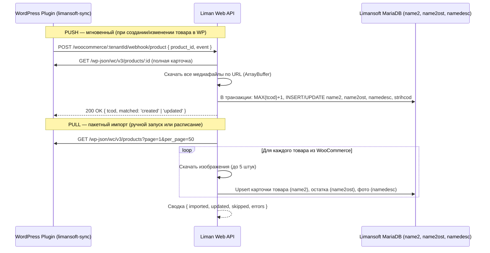

# Техническое руководство: Как устроен и работает Liman Web API

**Liman Web API** — это высокопроизводительный мультитенантный микросервис интеграции учетных баз данных **Limansoft** (MariaDB / MySQL) с внешними платформами электронной коммерции (**WooCommerce**, **Rozetka**, **Prom.ua**, **Хорошоп**).

В этом документе подробно описаны архитектура, внутренние процессы, потоки данных (Data Flow), механизмы синхронизации и специфика работы с legacy-базами Limansoft.

---

## 📑 Содержание

1. [Архитектурный обзор и назначение](#1-архитектурный-обзор-и-назначение)
2. [Data Access Layer: Как устроена база Limansoft](#2-data-access-layer-как-устроена-база-limansoft)
3. [Мультиарендность (Multi-Tenancy) и Connection Manager](#3-мультиарендность-multi-tenancy-и-connection-manager)
   - [Как устроен и работает пул соединений (mysql.createPool)](#31-как-устроен-и-работает-пул-соединений-mysqlcreatepool)
   - [Разделение клиентов: WooCommerce vs Rozetka](#32-разделение-клиентов-woocommerce-vs-rozetka)
   - [Как клиенты обновляются и синхронизируются](#33-как-клиенты-обновляются-и-синхронизируются)
4. [Стриминг медиа: BLOB в HTTP URL](#4-стриминг-медиа-blob-в-http-url)
5. [Синхронизация каталогов (Outbound Sync)](#5-синхронизация-каталогов-outbound-sync)
   - [WooCommerce (REST API + WP Plugin)](#51-woocommerce-rest-api--wp-plugin)
     - [Двусторонний импорт каталога (WooCommerce ➔ Limansoft / Two-Way Sync)](#511-двусторонний-импорт-каталога-woocommerce--limansoft--two-way-sync)
   - [Rozetka Marketplace (YML Feed + Seller API)](#52-rozetka-marketplace-yml-feed--seller-api)
   - [Prom.ua (Потоковый XML/YML фид)](#53-promua-потоковый-xmlyml-фид)
   - [Хорошоп (Гибридная схема + Polling)](#54-хорошоп-гибридная-схема--polling)
     - [Двусторонний импорт каталога (Хорошоп ➔ Limansoft / Two-Way Sync)](#541-двусторонний-импорт-каталога-хорошоп--limansoft--two-way-sync)
6. [Обработка заказов и списание остатков (Real-time Stock Deduction)](#6-обработка-заказов-и-списание-остатков-real-time-stock-deduction)
7. [Очереди и асинхронные задачи (BullMQ + Redis)](#7-очереди-и-асинхронные-задачи-bullmq--redis)
8. [Резервное копирование и откат БД Limansoft (Backup & Disaster Recovery)](#8-резервное-копирование-и-откат-бд-limansoft-backup--disaster-recovery)
   - [8.1 Назначение и архитектура BackupModule](#81-назначение-и-архитектура-backupmodule)
   - [8.2 Режимы: Fast (каталог) vs Full (полный дамп с медиа BLOB)](#82-режимы-fast-каталог-vs-full-полный-дамп-с-медиа-blob)
   - [8.3 Распределенная блокировка (Redis Distributed Lock)](#83-распределенная-блокировка-redis-distributed-lock)
   - [8.4 Потоковая компрессия Gzip и контроль целостности SHA-256](#84-потоковая-компрессия-gzip-и-контроль-целостности-sha-256)
   - [8.5 Автоматическая ротация (Retention Policy)](#85-автоматическая-ротация-retention-policy)
   - [8.6 REST API резервного копирования](#86-rest-api-резервного-копирования)
9. [Веб-интерфейс и архитектура раздачи статики (React SPA + Nginx)](#9-веб-интерфейс-и-архитектура-раздачи-статики-react-spa--nginx)
   - [9.1 Разделение обязанностей (Nginx vs NestJS)](#91-разделение-обязанностей-nginx-vs-nestjs)
   - [9.2 Трехуровневая инфраструктура Docker Compose](#92-трехуровневая-инфраструктура-docker-compose)
   - [9.3 Фронтенд React SPA: Стек и архитектура](#93-фронтенд-react-spa-стек-и-архитектура)
   - [9.4 Интернационализация (i18n): RU / UK](#94-интернационализация-i18n-ru--uk)
   - [9.5 Аутентификация, Magic Links и перехватчик Axios](#95-аутентификация-magic-links-и-перехватчик-axios)
10. [Безопасность и жизненный цикл запроса](#10-безопасность-и-жизненный-цикл-запроса)
11. [Сводная таблица соответствия сущностей](#11-сводная-таблица-соответствия-сущностей)
12. [Справочник основных REST API эндпоинтов](#12-справочник-основных-rest-api-эндпоинтов)

---

## 1. Архитектурный обзор и назначение

### Проблема, которую решает сервис
Учетная система **Limansoft** — это локальная Windows-программа с базой данных MariaDB/MySQL. Её структура создавалась для работы внутри розничных магазинов и оптовых складов. У неё есть особенности:
- Товары идентифицируются внутренним числовым кодом `tcod`.
- Фотографии хранятся непосредственно в таблице `namedesc` как бинарные блобы (`LONGBLOB`), а не в виде веб-ссылок.
- Цены хранятся в 31 отдельной колонке (`cena1`...`cena31`), а остатки разделены по складам (`skl_k`, `skl_kt` и др.).
- Современные маркетплейсы требуют открытых HTTP REST API, вебхуков, потоковых фидов и публичных URL к изображениям.

**Liman Web API** выступает интеллектуальным шлюзом, который транслирует запросы маркетплейсов в оптимизированные SQL-запросы к MariaDB и обратно, защищает базы клиентов с помощью распределенных блокировок и резервных копий, а также предоставляет удобный мультиязычный веб-интерфейс (SPA) для администраторов и клиентов.

### Общая архитектурная схема

```
┌───────────────────────────────────────────────────────────────────────────────────────────┐
│                                ПОЛЬЗОВАТЕЛИ И ВНЕШНИЕ СЕРВИСЫ                             │
│                                                                                           │
│   Браузеры пользователей (SPA)            Маркетплейсы и витрины электронной коммерции    │
│   ┌─────────────────────────────┐         ┌─────────────┐ ┌──────────┐ ┌────────┐ ┌─────┐ │
│   │ SuperAdmin / Client Portal  │         │ WooCommerce │ │ Rozetka  │ │Prom.ua │ │Хоро-│ │
│   │ RU / UK (React 19 + Vite 8) │         │ (WP Plugin) │ │Seller API│ │YML Feed│ │шоп  │ │
│   └──────────────┬──────────────┘         └──────┬──────┘ └────┬─────┘ └───┬────┘ └──┬──┘ │
└──────────────────┼───────────────────────────────┼─────────────┼───────────┼─────────┼────┘
                   │                               │             │           │         │
                   ▼                               ▼             ▼           ▼         ▼
┌───────────────────────────────────────────────────────────────────────────────────────────┐
│                                NGINX REVERSE PROXY & STATIC                               │
│                                                                                           │
│   Порт 80:                                                                                │
│   - Раздача статики SPA (try_files $uri $uri/ /index.html) из ./public/app                │
│   - Кэширование ассетов (expires 1y, Cache-Control: public, immutable) + gzip             │
│   - Проксирование API: location /api/ -> proxy_pass http://nestjs:3000                    │
└───────────────────────────────────────────────┬───────────────────────────────────────────┘
                                                │
                                                ▼
┌───────────────────────────────────────────────────────────────────────────────────────────┐
│                               LIMAN WEB API (NestJS Core)                                 │
│                                                                                           │
│ ┌───────────────────────────────────────────────────────────────────────────────────────┐ │
│ │                             Слой безопасности и роутинга                              │ │
│ │  ApiKeyGuard (x-api-key / IDOR) │ Public Endpoints (@Public) │ Helmet │ Throttler     │ │
│ └──────────────────────────────────────────┬────────────────────────────────────────────┘ │
│                                            │                                              │
│ ┌──────────────────────────────────────────▼────────────────────────────────────────────┐ │
│ │                                  Бизнес-модули API                                    │ │
│ │  WoocommerceModule │ RozetkaModule │ PromModule │ HoroshopModule │ MediaModule (BLOB) │ │
│ │  TenantModule      │ BackupModule  │ QueueModule (BullMQ Worker)                      │ │
│ └─────────────────────┬────────────────────┬──────────────────────────────────┬─────────┘ │
│                       │                    │                                  │           │
│ ┌─────────────────────▼──────┐  ┌──────────▼──────────────┐  ┌────────────────▼─────────┐ │
│ │    TenantConnectionManager │  │    Redis 7 Distributed  │  │    Local Filesystem      │ │
│ │    Динамические пулы к     │  │    Locks & BullMQ Queue │  │    (data/backups/ &      │ │
│ │    MariaDB каждого тенанта │  │    lock:tenant:{id}:busy│  │     data/tenants.sqlite) │ │
│ └─────────────────────┬──────┘  └─────────────────────────┘  └──────────────────────────┘ │
└───────────────────────┼───────────────────────────────────────────────────────────────────┘
                        │
                        ▼
┌───────────────────────────────────────────────────────────────────────────────────────────┐
│                             БАЗЫ ДАННЫХ LIMANSOFT (MariaDB)                               │
│                                                                                           │
│   ┌──────────┐     ┌──────────┐     ┌──────────┐     ┌──────────┐     ┌───────────────┐   │
│   │  name2   │     │ name2ost │     │ namedesc │     │   name   │     │   strihcod    │   │
│   │  Товары  │     │ Остатки  │     │ BLOB Фото│     │Категории │     │  Штрихкоды    │   │
│   └──────────┘     └──────────┘     └──────────┘     └──────────┘     └───────────────┘   │
└───────────────────────────────────────────────────────────────────────────────────────────┘
```

---

## 2. Data Access Layer: Как устроена база Limansoft

Сервис работает напрямую с реляционными таблицами MariaDB. Ниже приведено назначение каждой таблицы:

### 1. Таблица `name2` — Каталог товаров
Основная карточка товара.
- `tcod` *(int, PK)* — уникальный внутренний код товара в Limansoft. Именно он используется во всех интеграциях как **SKU** (WooCommerce) или **Article / External ID** (Rozetka, Prom, Хорошоп).
- `name` *(varchar)* — наименование товара.
- `group` *(varchar)* — код категории товара (соответствует таблице `name.group`).
- `nnom` *(varchar)* — основной артикул или штрихкод.
- `cena1` ... `cena31` *(decimal)* — колонки цен. Например, `cena1` — себестоимость/закупка, `cena2` — стандартная розничная цена.
- `producer` *(varchar)* — производитель / бренд товара.
- `vid` *(int)* — флаг типа записи (`vid = 0` — активный товар, `vid = 1` — услуга или удаленный товар). Сервис фильтрует товары условием `vid = 0`.

### 2. Таблица `name2ost` — Складские остатки
Остатки товаров в разрезе складов и торговых точек.
- `tcod` *(int, PK)* — связь с `name2.tcod`.
- `skl_k` *(decimal)* — остаток на центральном складе (колонка по умолчанию).
- `skl_kt`, `skl_r` и др. — остатки по дополнительным торговым точкам.

### 3. Таблица `namedesc` — Описания и изображения (BLOB)
- `tcod` *(int, PK)* — код товара.
- `descrip` *(text/mediumblob)* — текстовое описание товара (часто с HTML-разметкой).
- `photo1`, `photo2` ... `photo5` *(longblob)* — бинарные данные фотографий товара.

### 4. Таблица `name` — Иерархия категорий
- `group` *(varchar, PK)* — строковый код группы (например, `'0103'`).
- `name` *(varchar)* — название категории.
- `parent` *(varchar)* — код родительской категории для построения дерева.

### 5. Таблица `strihcod` — Дополнительные штрихкоды
- У одного товара (`tcod`) может быть несколько штрихкодов (от разных упаковок, весовые и т.д.). Таблица связывает `tcod` и штрихкоды `barcode`.

---

## 3. Мультиарендность (Multi-Tenancy) и Connection Manager

Сервис построен по архитектурной модели **Database-per-Tenant** с динамической маршрутизацией подключений (**Logical Multi-Tenancy**). У каждого клиента своя независимая база данных Limansoft (MariaDB / MySQL), часто развернутая на собственном сервере магазина или локальном компьютере с белым IP.

```
┌────────────────────────────────────────────────────────────────────────┐
│             Liman Web API (Единое ядро приложения)                     │
│                                                                        │
│   Мастер-БД SQLite (tenants.sqlite): реестр клиентов и их ключей      │
│   ┌────────────────────────────────────────────────────────────────┐   │
│   │ id: "client-a" (WooCommerce) -> база: 192.168.1.10/liman_clientA│   │
│   │ id: "client-b" (Rozetka)     -> база: 10.0.0.5/liman_clientB   │   │
│   └────────────────────────────────────────────────────────────────┘   │
└───────────────┬────────────────────────────────────────┬───────────────┘
                │                                        │
        Запрос к /client-a                       Запрос к /client-b
                │                                        │
        ┌───────▼────────┐                       ┌───────▼────────┐
        │  Пул коннектов │                       │  Пул коннектов │
        │     КЛИЕНТ А   │                       │    КЛИЕНТ Б    │
        └───────┬────────┘                       └───────┬────────┘
                │                                        │
    ┌───────────▼───────────┐                ┌───────────▼───────────┐
    │ MariaDB 1 (Клиент А)  │                │ MariaDB 2 (Клиент Б)  │
    │ База: liman_clientA   │                │ База: liman_clientB   │
    └───────────┬───────────┘                └───────────┬───────────┘
                │                                        │
        Синхронизация                            Синхронизация
                │                                        │
    ┌───────────▼───────────┐                ┌───────────▼───────────┐
    │ Магазин WooCommerce   │                │ Маркетплейс Rozetka   │
    │ (client-a.com/wp-json)│                │ (api-seller.rozetka)  │
    └───────────────────────┘                └───────────────────────┘
```

---

### 3.1 Как устроен и работает пул соединений (`mysql.createPool`)

Создание и кэширование пулов инкапсулировано в классе `TenantConnectionManager`:

```typescript
const pool = mysql.createPool({
  host: tenant.dbHost,
  port: tenant.dbPort,
  user: tenant.dbUser,
  password: tenant.dbPassword,
  database: tenant.dbName,
  waitForConnections: true,
  connectionLimit: 10,
  queueLimit: 0,
  enableKeepAlive: true,
  keepAliveInitialDelay: 10000,
  timezone: '+00:00',
});
```

#### Зачем нужен пул (Pool vs Single Connection)
- **Без пула**: каждый входящий HTTP-запрос открывает новый TCP-сокет к MariaDB, делает TLS/SSL рукопожатие, проходит аутентификацию пользователя, выполняет SQL и закрывает соединение. Это занимает 20–100+ мс накладных расходов на каждый запрос и быстро приводит к ошибке MariaDB `Too many connections`.
- **С пулом**: приложение держит готовую переиспользуемую «обойму» активных постоянных соединений (Persistent Connections). Запрос мгновенно берёт свободное соединение из пула, выполняет SQL и возвращает его обратно (`connection.release()`).

#### Назначение параметров конфигурации:
1. **`connectionLimit: 10`**:
   - Максимальное число физических TCP-соединений к MariaDB конкретного клиента.
   - Защищает базу магазина от перегрузки: если на витрину клиента одновременно придет 200 пользователей, сервис не откроет 200 тяжелых коннектов к базе, а ограничит параллелизм 10 потоками.
2. **`waitForConnections: true`**:
   - Если все 10 соединений в данный момент заняты выполнением запросов, 11-й запрос **не падает с ошибкой**, а становится в очередь ожидания первого освободившегося коннекта.
3. **`queueLimit: 0`**:
   - Максимальная глубина очереди ожидания. Значение `0` означает отсутствие лимита очереди (запросы выполняются последовательно по мере освобождения ресурсов пула).
4. **`enableKeepAlive: true` и `keepAliveInitialDelay: 10000`**:
   - Включает TCP Keep-Alive на сокетах соединений.
   - Каждые 10 секунд (10 000 мс) простоя операционная система отправляет проверочный TCP-пакет.
   - Это защищает от «тихого» обрыва неактивных коннектов межсетевыми экранами (Firewall), NAT-маршрутизаторами и тайм-аутами простоя самой MariaDB (`wait_timeout`).
5. **`timezone: '+00:00'`**:
   - Синхронизирует обработку полей даты и времени (`DATETIME`, `TIMESTAMP`) строго в UTC, предотвращая искажения времени создания товаров и заказов при переносе между Node.js и MariaDB.
6. **Lazy-инициализация**:
   - Соединения внутри пула не создаются все 10 сразу. Они открываются по требованию при появлении реальных SQL-запросов и затем остаются прогретыми в оперативной памяти.

---

### 3.2 Разделение клиентов: WooCommerce vs Rozetka

Представим сценарий:
- **Клиент 1 (`shop-a`)**: владелец интернет-магазина на **WooCommerce**. Его учетная база Limansoft расположена на сервере `192.168.1.10:3306/liman_shopA`.
- **Клиент 2 (`shop-b`)**: продавец на маркетплейсе **Rozetka**. Его база Limansoft расположена на сервере `10.0.0.5:3306/liman_shopB`.

Разделение и изоляция обеспечиваются на 4 уровнях:

#### Уровень 1: Реестр тенантов (Master Database SQLite)
В базе `./data/liman_master.sqlite` хранятся раздельные конфигурации:
- Запись `shop-a`: реквизиты к БД `liman_shopA`, персональный `apiKey`, параметры WooCommerce (`wcUrl`, `wcConsumerKey`, `wcConsumerSecret`).
- Запись `shop-b`: реквизиты к БД `liman_shopB`, персональный `apiKey`, параметры Rozetka (`rozetkaClientId`, `rozetkaClientSecret`).

#### Уровень 2: Изоляция адресного пространства (URL Namespaces)
Все эндпоинты в API строго привязаны к идентификатору клиента `:tenantId`:
- Для Клиента А (WooCommerce):
  - `POST /api/v1/woocommerce/shop-a/sync` — синхронизация цен и остатков.
  - `POST /api/v1/woocommerce/shop-a/webhook/order` — приём заказов WooCommerce.
- Для Клиента Б (Rozetka):
  - `GET  /api/v1/rozetka/shop-b/feed.xml` — персональный XML-каталог Розетки.
  - `POST /api/v1/rozetka/shop-b/sync/prices-stocks` — пакетное обновление цен и остатков (`PUT /items/mass-update`).
  - `POST /api/v1/rozetka/shop-b/sync/orders` — опрос новых заказов Розетки.

#### Уровень 3: Безопасность и авторизация (`ApiKeyGuard`)
Каждый входящий запрос проверяется гардом безопасности:
- Запрос от Клиента А с его заголовком `x-api-key` валидируется исключительно против настроек `shop-a`.
- Клиент А не может вызвать методы или просмотреть фид Клиента Б — запрос с неверным ключом отклоняется со статусом `HTTP 401 / 403`.

#### Уровень 4: Изоляция пулов MariaDB (`TenantConnectionManager`)
Менеджер пулов хранит реестр соединений в `Map<string, Pool>`:
```typescript
getPool(tenant: Tenant): Pool {
  if (this.pools.has(tenant.id)) {
    return this.pools.get(tenant.id)!;
  }
  const pool = mysql.createPool({ ... });
  this.pools.set(tenant.id, pool);
  return pool;
}
```
- Запросы для `shop-a` направляются **только** в пул базы `liman_shopA`.
- Запросы для `shop-b` направляются **только** в пул базы `liman_shopB`.
- Физическое смешение данных невозможно — запросы исполняются в совершенно разных TCP-соединениях к разным базам данных.

---

### 3.3 Как клиенты обновляются и синхронизируются

Процессы синхронизации двух клиентов полностью независимы и могут работать одновременно:

| Сценарий | Клиент А (WooCommerce) | Клиент Б (Rozetka) |
| :--- | :--- | :--- |
| **Выгрузка каталога (Каталог ➔ Витрина)** | `POST /woocommerce/shop-a/sync`<br>Выбирает измененные товары из `liman_shopA` и пушит батчами по 100 товаров через REST API WooCommerce (`/wp-json/wc/v3/products/batch`). | **Фид**: `GET /rozetka/shop-b/feed.xml` скачивается роботом Розетки.<br>**Дельта-синхронизация**: `POST /rozetka/shop-b/sync/prices-stocks` читает остатки из `liman_shopB` и отправляет в Rozetka Seller API через `PUT /items/mass-update`. |
| **Списание остатков при заказе (Витрина ➔ Liman)** | Покупатель оформил заказ в WooCommerce ➔ магазин шлёт webhook на `/woocommerce/shop-a/webhook/order` ➔ сервис выполняет `UPDATE name2ost ...` **строго в базе `liman_shopA`**. | Покупатель оформил заказ на Rozetka ➔ сервис по крону или через `/rozetka/shop-b/sync/orders` забирает новые заказы ➔ выполняет `UPDATE name2ost ...` **строго в базе `liman_shopB`**. |
| **Фоновые задачи (BullMQ + Redis)** | Отдельная очередь/джоба: `{ tenantId: 'shop-a', type: 'woocommerce' }`. | Отдельная очередь/джоба: `{ tenantId: 'shop-b', type: 'rozetka' }`. |

**Результат**: если база данных Клиента А временно недоступна (например, выключен сервер в магазине), Клиент Б продолжает работать, отдавать XML-фид и синхронизировать остатки с Розеткой без малейших задержек или сбоев.

---

## 4. Стриминг медиа: BLOB в HTTP URL

Внешние площадки (Prom, Rozetka, WooCommerce) не умеют загружать картинки из базы данных напрямую — им требуются публичные HTTP URL (`.jpg` / `.png`).

Сервис решает эту проблему модулем `MediaModule`:
```http
GET /api/v1/media/:tenantId/products/:tcod/:photoIndex.jpg
```

### Внутренний механизм работы:
1. Запрос поступает в `MediaController`.
2. `LimanService` выполняет точечный SQL-запрос:
   ```sql
   SELECT photo1 FROM namedesc WHERE tcod = ? LIMIT 1
   ```
3. Если бинарный буфер найден:
   - Вычисляется контрольная сумма буфера (MD5 hash) для генерации `ETag`.
   - Проверяется заголовок запроса `If-None-Match`: если хэш совпадает, сервер мгновенно возвращает **HTTP 304 Not Modified** без передачи тела картинки. Это экономит до 90% сетевого трафика.
   - Устанавливаются заголовки `Content-Type: image/jpeg` и `Cache-Control: public, max-age=86400`.
   - Бинарный поток передается клиенту.
4. Если фото отсутствует:
   - Генерируется чистый векторный SVG-плейсхолдер с названием товара и возвращается со статусом `HTTP 200`.

---

## 5. Синхронизация каталогов (Outbound Sync)

Каждая e-commerce платформа имеет свои особенности экспорта каталога:

### 5.1. WooCommerce (REST API + WP Plugin)
- **Идентификация товаров**: SKU в WooCommerce = `tcod` в Limansoft.
- **Пакетная выгрузка (`batchUpsertProducts`)**:
  - Товары отправляются чанками по 50 штук на эндпоинт `/wp-json/wc/v3/products/batch`.
  - Перед отправкой сервис делает предварительный запрос, чтобы проверить, какие SKU уже существуют в WordPress. Товары автоматически разделяются на списки `create` (новые) и `update` (существующие). Это предотвращает ошибку `product_invalid_sku`.
  - Увеличен таймаут HTTP-запроса до 120 секунд для стабильности на медленных хостингах.
- **WordPress плагин (`packages/limansoft-sync-woocommerce`)**:
  - В админ-панели WordPress появляется вкладка **WooCommerce → Limansoft Sync**.
  - Настраивается URL API, Tenant ID и API Key.
  - **Планировщик WP-Cron**: настраиваемый интервал (15, 30 или 60 минут). При выключении переключателя задача сразу удаляется из cron, не создавая нагрузки на процессор сервера.
  - Поддержка WooCommerce HPOS (High-Performance Order Storage).

#### 5.1.1. Двусторонний импорт каталога (WooCommerce ➔ Limansoft / Two-Way Sync)

Помимо классической выгрузки каталога из учетной системы на витрину, сервис поддерживает **обратный импорт** товаров, созданных или отредактированных контент-менеджерами непосредственно в WooCommerce (или импортированных из других источников).

##### Архитектура и потоки данных (Data Flow):



##### Ключевые механизмы двустороннего импорта:
1. **Два режима работы:**
   - **PUSH (Event-Driven)**: плагин перехватывает хуки WordPress `woocommerce_new_product` и `woocommerce_update_product` и мгновенно отправляет вебхук `POST /api/v1/woocommerce/:tenantId/webhook/product`. В настройках плагина доступен тумблер (галочка) *"Автоматически передавать новые и измененные товары в Limansoft"*.
   - **PULL (Batch Import)**: вызов `POST /api/v1/woocommerce/:tenantId/import/products` выполняет постраничную загрузку каталога из WooCommerce API и синхронизирует его в учетную базу.
2. **Алгоритм сопоставления (Matching & Deduplication):**
   - Если SKU товара в WooCommerce — целое число (например, `251`), система ищет товар в `name2` по `tcod = 251` и выполняет обновление (`UPDATE`).
   - Если SKU строковый или задан штрихкод, выполняется поиск в `strihcod.nnom`. При нахождении обновляется соответствующий `tcod`.
   - Если товар не найден ни по одному признаку, открывается транзакция с блокировкой `SELECT MAX(tcod) + 1 FROM name2 FOR UPDATE`, генерируется новый атомарный `tcod`, и создается новая запись в `name2`, `name2ost` и `strihcod`.
3. **Загрузка и сохранение изображений:**
   - Из WooCommerce извлекаются все ссылки на изображения (до 5 штук).
   - Сервер асинхронно скачивает бинарные данные по HTTP, валидирует их и сохраняет в BLOB-поля таблицы `namedesc` (`photo`, `photo2`, `photo3`, `photo4`, `photo5`). Благодаря этому кассиры и операторы сразу видят фотографии в десктопном приложении Limansoft.
4. **Защита от зацикливания (Anti-Loop Protection):**
   - Чтобы выгрузка из Limansoft в WooCommerce не вызывала повторный обратный вебхук в Limansoft, при обновлении товаров через API выставляется временный маркер (meta/transient), подавляющий отправку хука плагином.

### 5.2. Rozetka Marketplace (YML Feed + Seller API)
- **Потоковый фид (`feed.xml`)**:
  - Rozetka требует строгий формат YML (Yandex Market Language) со специфическими тегами: `<vendorCode>`, `<picture>`, `<param name="Кількість">`.
  - Фид генерируется в потоковом режиме частями по 200 товаров прямо в Express Response Stream, удерживая потребление RAM на уровне нескольких мегабайт даже при 50 000 товаров.
- **Rozetka Seller API**:
  - Модуль `RozetkaAuthService` авторизуется через `POST /api/auth` по логину и паролю продавца, получая JWT токен.
  - Токен кэшируется в памяти.
  - Метод `syncPricesAndStocks` отправляет обновления цен и остатков батчами по 100 товаров непосредственно в Seller API.

### 5.3. Prom.ua (Потоковый XML/YML фид)
- Эндпоинт `/api/v1/prom/:tenantId/feed.xml` отдает потоковый YML фид.
- Описания товаров оборачиваются в секции `<![CDATA[...]]>`.
- Иерархия категорий строится по дереву таблицы `name`.

### 5.4. Хорошоп (Гибридная схема + Polling)
Платформа Хорошоп поддерживает **гибридный подход**:
1. **Потоковый XML-фид**: Хорошоп сам забирает каталог по расписанию (раз в 2-4 часа), обновляя описания, картинки и категории.
2. **REST API (`/api/catalog/import/`)**: быстрый пуш цен и остатков порциями по 100 товаров.
3. **MOCK-режим (Sandbox)**: если в поле домена указано `mock.horoshop.ua`, API включает симуляцию ответов для тестирования без привязки к реальному магазину.

#### 5.4.1. Двусторонний импорт каталога (Хорошоп ➔ Limansoft / Two-Way Sync)

Позволяет перенести каталог товаров из витрины Хорошоп (Cartum) напрямую в локальную базу данных Limansoft. Это незаменимо при первичном запуске системы, когда каталог уже наполнен в Хорошоп, либо для периодической синхронизации карточек товаров.

```
┌────────────────────────────────────────────────────────────────────────────────────────┐
│                        ПОТОК ДВУСТОРОННЕГО ИМПОРТА ХОРОШОП ➔ LIMANSOFT                 │
│                                                                                        │
│  1. Веб-интерфейс / API              2. NestJS HoroshopImportEngine    3. MariaDB      │
│  ┌───────────────────────┐           ┌───────────────────────────┐     ┌─────────────┐ │
│  │ Запрос импорта:       │           │ ПРОВЕРКА БЕКАПА:          │     │             │ │
│  │ - mode: skip_existing │──────────>│ Если бекап не создан      │     │             │ │
│  │   или overwrite       │           │ за последние 24ч ➔ Alert  │     │             │ │
│  │ - confirm_risk: true  │           │                           │     │             │ │
│  └───────────────────────┘           │ ПАКЕТНЫЙ СБОР ИЗ ХОРОШОП: │     │             │ │
│                                      │ GET /pages/export         │     │             │ │
│                                      │ батчи по 100 товаров      │     │             │ │
│                                      └─────────────┬─────────────┘     │             │ │
│                                                    │                   │             │ │
│                                      ┌─────────────▼─────────────┐     │             │ │
│                                      │ ОБРАБОТКА В ТРАНЗАКЦИИ:   │     │             │ │
│                                      │ - Поиск по tcod / nnom    │     │             │ │
│                                      │ - Режим overwrite:        │────>│ name2       │ │
│                                      │   UPDATE цен, остатков    │     │ name2ost    │ │
│                                      │ - Режим skip_existing:    │     │ namedesc    │ │
│                                      │   только INSERT новинок   │     │ strihcod    │ │
│                                      │ - Скачивание картинок     │     │             │ │
│                                      │   в BLOB (до 5 фото)      │     │             │ │
│                                      └─────────────┬─────────────┘     └─────────────┘ │
│                                                    │                                   │
│                                      ┌─────────────▼─────────────┐                     │
│                                      │ Итоговый JSON-отчет       │                     │
│                                      │ { created, updated,       │                     │
│                                      │   skipped, errors: [] }   │                     │
│                                      └───────────────────────────┘                     │
└────────────────────────────────────────────────────────────────────────────────────────┘
```

##### Режимы синхронизации и параметры безопасности:
1. **Режимы сопоставления (`mode`)**:
   - `skip_existing` (*«Только новые товары»*): сопоставляет товары по артикулу (`article`/`nnom`) и штрихкоду (`barcode`/`strihcod`). Если товар уже присутствует в Limansoft, он пропускается без изменения цен и остатков. Создаются только отсутствующие позиции.
   - `overwrite` (*«Перезаписать / Обновить существующие»*): при нахождении существующего товара в Limansoft обновляются его наименование, выбранная цена (`cena1`...`cena31`), складской остаток (`skl_k`) и описания.
2. **Обязательное предупреждение и валидация бекапа (Backup Warning Enforcement)**:
   - Массовая перезапись каталога — необратимая операция.
   - API и пользовательский интерфейс требуют обязательного флага подтверждения `confirm_backup: true`.
   - Система автоматически проверяет дату последнего успешного резервного копирования в `data/backups/{tenantId}`. Если бекап старше 24 часов или отсутствует, клиенту выдается строгое предупреждение с рекомендацией создать быстрый (`fast`) или полный (`full`) бекап в один клик перед запуском.
3. **Пакетная обработка и очереди (BullMQ)**:
   - Процесс выполняется асинхронно в воркере очереди `horoshop-catalog-import`.
   - Пагинация по каталогу Хорошоп (порции по 100 товаров).
   - Транзакционная запись в MariaDB с сохранением BLOB-фотографий в `namedesc` (до 5 ракурсов).
   - Клиент видит прогресс (0-100%) в реальном времени в окне Client Portal.

---

## 6. Обработка заказов и списание остатков (Real-time Stock Deduction)

Самая ответственная часть интеграции — предотвращение продажи товара, которого нет на складе (**overselling**).

### Сквозной цикл обработки заказа:

```
Покупатель оформляет заказ на маркетплейсе
                 │
                 ▼
      [Способ доставки заказа]
      ├── Вариант А: Мгновенный Webhook от маркетплейса
      └── Вариант B: Фоновый опрос Polling (/orders/get/)
                 │
                 ▼
   POST /api/v1/{platform}/:tenantId/webhook/order
                 │
                 ▼
┌─────────────────────────────────────────────────────────┐
│     1. Дедупликация (Защита от двойного списания)       │
│  Проверка orderId в Set<tenantId:orderId>.              │
│  Если заказ уже обрабатывался ранее — списание          │
│  пропускается с возвратом success: true.                │
└────────────────────────┬────────────────────────────────┘
                         │
                         ▼
┌─────────────────────────────────────────────────────────┐
│           2. Парсинг позиций заказа                     │
│  Для каждого товара извлекается article (tcod) и qty.   │
└────────────────────────┬────────────────────────────────┘
                         │
                         ▼
┌─────────────────────────────────────────────────────────┐
│       3. Атомарное обновление остатка в MariaDB         │
│  SELECT skl_k FROM name2ost WHERE tcod = ?              │
│  newStock = Math.max(0, currentStock - qty)             │
│  UPDATE name2ost SET skl_k = ? WHERE tcod = ?           │
└────────────────────────┬────────────────────────────────┘
                         │
                         ▼
      Формирование подробного JSON-отчета:
      {
        "success": true,
        "orderId": 10421,
        "processedItems": [
          { "tcod": 16, "requestedQty": 1, "oldStock": 339, "newStock": 338 }
        ]
      }
```

---

## 7. Очереди и асинхронные задачи (BullMQ + Redis)

Для длительных операций (полная выгрузка 10 000+ товаров в маркетплейс) используются асинхронные очереди на базе **BullMQ** и **Redis 7**.

### Преимущества очередей:
- **Нет блокировки HTTP**: клиент получает `202 Accepted` и `jobId` за несколько миллисекунд.
- **Устойчивость к сбоям**: при обрыве сети запрос автоматически повторяется с экспоненциальной задержкой (Retry Strategy).
- **Мониторинг прогресса**: воркер регулярно публикует прогресс от 0% до 100%.

### Эндпоинты управления очередями:
- `POST /api/v1/sync/:tenantId/stock` — постановка задачи обновления остатков в очередь `stock-sync`.
- `GET /api/v1/sync/jobs/:queueName/:jobId` — опрос состояния задачи (`waiting`, `active`, `completed`, `failed`), просмотр прогресса и логов ошибок.

---

## 8. Резервное копирование и откат БД Limansoft (Backup & Disaster Recovery)

В процессе интеграции каталогов и обмена данными с внешними витринами (особенно при массовых операциях двусторонней синхронизации из Хорошоп или WooCommerce) критически важна защита баз данных клиентов от повреждения, рассинхронизации или случайного удаления.

Для решения этой задачи в сервисе реализован модуль `BackupModule` (`src/modules/backup/`), обеспечивающий создание потоковых gzip-дампов, проверку контрольных сумм и гарантированный откат базы данных тенанта до сохраненного состояния.

### 8.1. Назначение и архитектура BackupModule

```
┌────────────────────────────────────────────────────────────────────────────────────────┐
│                        АРХИТЕКТУРА И ПОТОК РЕЗЕРВНОГО КОПИРОВАНИЯ                      │
│                                                                                        │
│  Client / Admin Request        BackupService                     Redis 7 & Filesystem  │
│  ┌───────────────────────┐     ┌───────────────────────────┐     ┌───────────────────┐ │
│  │ POST /api/v1/liman/   │     │ 1. REDIS DISTRIBUTED LOCK │     │ lock:tenant:      │ │
│  │ :tenantId/backups     │────>│    Атомарный захват мьютекса───>│ :columb:busy      │ │
│  │ { mode: "fast"|"full" }     │    (TTL 900s, 409 if busy)│     │ (SET NX EX)       │ │
│  └───────────────────────┘     └─────────────┬─────────────┘     └───────────────────┘ │
│                                              │                                         │
│                                ┌─────────────▼─────────────┐     ┌───────────────────┐ │
│                                │ 2. BATCH SELECT & STREAM  │     │ data/backups/     │ │
│                                │    Потоковая выборка по   │     │ :tenantId/        │ │
│                                │    500 строк из MariaDB   │     │                   │ │
│                                │    Pipeline: SQL Stream ──┼────>│ backup_columb_... │ │
│                                │    -> zlib.createGzip()   │     │ .sql.gz           │ │
│                                │    -> crypto.createHash() │     │                   │ │
│                                │    -> WriteStream         │     │ backup_columb_... │ │
│                                └─────────────┬─────────────┘     │ .meta.json        │ │
│                                              │                   └───────────────────┘ │
│                                ┌─────────────▼─────────────┐                           │
│                                │ 3. ROTATION & RELEASE     │                           │
│                                │    - Авторотация (max 10) │                           │
│                                │    - Освобождение лока    │                           │
│                                │    - Итоговые метаданные  │                           │
│                                └───────────────────────────┘                           │
└────────────────────────────────────────────────────────────────────────────────────────┘
```

### 8.2. Режимы: Fast (каталог) vs Full (полный дамп с медиа BLOB)

Модуль поддерживает два специализированных режима снятия дампа:

| Режим | Опрашиваемые таблицы | Содержит фото (BLOB) | Скорость создания | Типичный размер | Рекомендация к использованию |
|---|---|---|---|---|---|
| **`fast`** | `name2`, `name2ost`, `name`, `strihcod` | ❌ Нет | 1–3 секунды | 100 КБ – 5 МБ | **Обязательно перед синхронизациями**: перед запуском двустороннего импорта из Хорошоп/WooCommerce или пакетным обновлением цен. |
| **`full`** | Все таблицы базы (`SHOW TABLES`) | ✅ Да (`namedesc` до 5 фото) | 10–60 секунд | 50 МБ – 2 ГБ+ | **Плановое аварийное копирование**: перед обновлением структуры БД, переносом магазина или крупными регламентными работами. |

### 8.3. Распределенная блокировка (Redis Distributed Lock)

Для исключения гонок состояний (**Race Conditions**) и предотвращения одновременного выполнения несовместимых тяжелых операций (например, запуск восстановления поверх идущего бекапа или синхронизации остатков) используется распределенный мьютекс на базе Redis 7:

- **Ключ блокировки**: `lock:tenant:{tenantId}:busy`.
- **Механизм**: атомарная команда `SET lock:tenant:{tenantId}:busy <uuid> NX EX <ttl>`.
- **TTL (Time To Live)**:
  - `900 секунд` (15 минут) — для процесса создания резервной копии.
  - `1800 секунд` (30 минут) — для процесса отката базы данных.
- **Поведение при конфликте**: если ключ уже занят другим процессом, сервис немедленно возвращает ошибку `409 Conflict`:
  ```json
  {
    "statusCode": 409,
    "message": "Tenant columb is currently busy with another operation (backup/restore/sync). Please try again later.",
    "error": "Conflict"
  }
  ```
- **Безопасное освобождение**: снятие блокировки выполняется в блоке `finally` через проверку соответствия UUID, гарантируя, что процесс не снимет чужую блокировку в случае задержки.

### 8.4. Потоковая компрессия Gzip и контроль целостности SHA-256

- **Экономия оперативной памяти (Zero-RAM Leak)**: генерация SQL-дампа не загружает всю базу данных в память Node.js. Строки читаются порциями (batch size 500 строк) и передаются в цепочку потоков (Stream Pipeline):
  `Readable SQL Stream ➔ zlib.createGzip() ➔ fs.createWriteStream()`.
- **Контроль целостности (SHA-256 Integrity)**:
  В процессе сжатия дампа параллельно рассчитывается хеш `crypto.createHash('sha256')`.
  После завершения рядом с архивом создается файл метаданных `{filename}.meta.json`:
  ```json
  {
    "tenantId": "columb",
    "filename": "backup_columb_1710582000000_fast.sql.gz",
    "mode": "fast",
    "size": 348160,
    "sha256": "8f4b23c89a0e67b9319e7a685ef89476b78f4a13d5b0d468165b6f3630f5b128",
    "tables": ["name2", "name2ost", "name", "strihcod"],
    "createdAt": "2026-09-16T08:00:00.000Z"
  }
  ```
- **Валидация при откате (`restore`)**: перед выполнением SQL-команд архив повторно проверяется на совпадение контрольной суммы SHA-256. Если архив поврежден или модифицирован, операция аварийно прерывается (`400 Bad Request: Checksum mismatch`).

### 8.5. Автоматическая ротация (Retention Policy)

Для предотвращения переполнения дискового пространства модуль автоматически очищает старые архивы после каждого успешного бекапа:
1. **Лимит количества**: хранится не более **10 последних архивов** для каждого тенанта.
2. **Лимит давности**: архивы старше **30 дней** удаляются автоматически.
3. Сопутствующие файлы `.meta.json` удаляются синхронно с архивами.

### 8.6. REST API резервного копирования

| Метод | URL | Описание | Ответ |
|---|---|---|---|
| `POST` | `/api/v1/liman/:tenantId/backups` | Создать резервную копию (`{ mode: "fast" \| "full" }`) | `201 Created` с метаданными бекапа |
| `GET` | `/api/v1/liman/:tenantId/backups` | Получить список всех бекапов магазина | `200 OK` массив объектов бекапов с размерами и датами |
| `GET` | `/api/v1/liman/:tenantId/backups/:filename/download` | Скачать `.sql.gz` файл архива | `200 OK` (Stream Attachment, Content-Disposition) |
| `POST` | `/api/v1/liman/:tenantId/backups/:filename/restore` | Откатить БД до состояния выбранного бекапа | `200 OK` `{ restored: true, filename, durationMs }` |
| `DELETE` | `/api/v1/liman/:tenantId/backups/:filename` | Удалить резервную копию и метаданные с диска | `200 OK` `{ deleted: true, filename }` |

---

## 9. Веб-интерфейс и архитектура раздачи статики (React SPA + Nginx)

Для удобного администрирования сервиса и предоставления клиентам личного кабинета разработан современный одностраничный веб-интерфейс (**SPA — Single Page Application**).

### 9.1. Разделение обязанностей (Nginx vs NestJS)

Ключевой архитектурный принцип: **Node.js не должен тратить ресурсы на раздачу статических файлов**.

```
                           [Клиентский браузер]
                                    │
                                    ▼ HTTP (Порт 80)
                     ┌─────────────────────────────┐
                     │            NGINX            │
                     └──────────────┬──────────────┘
                                    │
            ┌───────────────────────┴───────────────────────┐
            │ URL: /assets/*, /index.html                   │ URL: /api/*
            ▼                                               ▼
┌───────────────────────────────┐               ┌───────────────────────────────┐
│     ДИСКОВАЯ СТАТИКА SPA      │               │        NESTJS BACKEND         │
│  - Нативный sendfile() C      │               │  - Чистый REST API            │
│  - Gzip компрессия в Nginx    │               │  - Event Loop свободен        │
│  - Cache-Control: immutable   │               │  - Обработка транзакций SQL   │
│  - Отклик: < 1-2 мс           │               │  - Воркеры очередей BullMQ    │
└───────────────────────────────┘               └───────────────────────────────┘
```

- **Nginx**:
  - Нативно обслуживает статический билд из директории `./public/app`.
  - Маршрутизация `try_files $uri $uri/ /index.html;` перенаправляет все SPA-маршруты на единую точку входа React Router.
  - Настроено агрессивное кэширование сборки: для файлов в `/assets/` выставляется заголовок `Cache-Control: public, max-age=31536000, immutable`.
  - Включено сжатие gzip для текстовых форматов (`text/html`, `application/javascript`, `text/css`, `image/svg+xml`).
- **NestJS**:
  - Полностью изолирован за обратным прокси (`proxy_pass http://nestjs:3000`).
  - Не держит статических middleware в конвейере, что исключает деградацию производительности Event Loop.

### 9.2. Трехуровневая инфраструктура Docker Compose

Вся система запускается тремя взаимосвязанными контейнерами (`docker-compose.yml`):

1. `nginx` (`nginx:alpine`): точка входа (порт `80:80`), монтирует `./docker/nginx.conf` и директорию фронтенд-билда `./public/app:/usr/share/nginx/html:ro`.
2. `nestjs` (`node:20-alpine`): ядро API (порт `3000`), монтирует локальное хранилище `./data:/app/data` (база SQLite и архивы бекапов MariaDB).
3. `redis` (`redis:7-alpine`): оперативная память очередей BullMQ и распределенных мьютексов (порт `6379:6379`).

### 9.3. Фронтенд React SPA: Стек и архитектура

Интерфейс расположен в директории `client/` и построен на передовом стеке:
- **Движок и фреймворк**: React 19 + TypeScript + Vite 8.
- **Дизайн-система**: Корпоративная темная тема (Enterprise Dark Glassmorphism):
  - Цветовая палитра: глубокий ночной графит (`#0b0f19`), контрастные границы с размытием (`backdrop-filter: blur(12px)`), акцентные индикаторы статуса соединения с БД (зеленый / красный пульсирующие бейджи).
  - Микроанимации появления элементов и интерактивные карточки с эффектом свечения.
- **Структура маршрутов (`client/src/App.tsx`)**:
  - `/login` — универсальный экран авторизации (переключатель режимов: Администратор платформы / Клиент магазина).
  - `/superadmin/*` — панель суперадминистратора:
    - Мониторинг всех подключенных тенантов.
    - Добавление и редактирование магазинов, проверка подключения к MariaDB (Ping).
    - Ротация Tenant API ключей.
  - `/portal/:tenantId/*` — клиентский портал конкретного магазина:
    - Управление интеграциями (Хорошоп, Prom.ua, Rozetka, WooCommerce).
    - Запуск и мониторинг двустороннего импорта каталога с предупреждением о бекапе.
    - Раздел «Резервные копии»: создание Fast/Full бекапов в 1 клик, скачивание архивов и откат базы данных.

### 9.4. Интернационализация (i18n): RU / UK

Для удобства пользователей система поддерживает полную двуязычность:
- **Языки**: Русский (`ru`) и Украинский (`uk`).
- **Словарь**: Более 90 ключей локализации охватывают все разделы, формы, статусы ошибок и системные уведомления (`client/src/i18n/translations.ts`).
- **Алгоритм выбора языка (`LanguageContext.tsx`)**:
  1. Если пользователь ранее выбрал язык вручную, он загружается из `localStorage` (`liman_lang`).
  2. Если выбор отсутствует, сервис считывает язык операционной системы и браузера (`navigator.language`). Если язык украинский (`uk` или `uk-UA`), активируется украинский интерфейс, в остальных случаях — русский.
- **Интерактивный переключатель**: Компонент `LanguageSelector` в верхнем меню позволяет переключить локализацию в один клик (флаги 🇷🇺 RU / 🇺🇦 UK) с мгновенным обновлением всех текстов без перезагрузки страницы.

### 9.5. Аутентификация, Magic Links и перехватчик Axios

- **Безопасное хранение сессии (`AuthContext.tsx`)**:
  Токены доступа хранятся исключительно в `sessionStorage`. При закрытии вкладки сессия уничтожается, что снижает риск кражи токенов через XSS по сравнению с `localStorage`.
- **Поддержка входа по Magic Link**:
  Администратор может сформировать клиенту прямую ссылку для входа в его кабинет:
  `http://<domain>/portal/columb?token=XYZ&tid=columb`.
  При открытии ссылки `AuthContext`:
  1. Извлекает параметры `token` и `tid` из строки запроса.
  2. Сохраняет их в сессию и устанавливает роль `tenant`.
  3. Бесшовно очищает адресную строку через `window.history.replaceState` без перезагрузки страницы, предотвращая сохранение секретного ключа в истории браузера.
- **Централизованный Axios Interceptor (`client/src/api/client.ts`)**:
  - На каждый исходящий запрос к `/api/*` автоматически добавляет заголовок `x-api-key`.
  - Отслеживает ответы сервера: при получении HTTP `401 Unauthorized` или `403 Forbidden` интерцептор мгновенно вызывает `logout()` и направляет пользователя на `/login`.

---

## 10. Безопасность и жизненный цикл запроса

### Уровни авторизации и изоляции
1. **Master API Key** (`MASTER_API_KEY` в `.env`):
   - Предоставляет доступ к управлению всеми тенантами (`/api/v1/tenants`).
   - Используется суперадминистраторами сервиса.
2. **Tenant API Key (Изоляция по IDOR/BOLA)**:
   - Генерируется автоматически при создании клиента.
   - Передается в заголовке `x-api-key`.
   - `ApiKeyGuard` строго сопоставляет `x-api-key` с параметром `:tenantId` в URL. Попытка запросить чужой магазин или список тенантов пресекается (`401 Unauthorized`).
   - Поддерживает мгновенную ротацию ключа: `POST /api/v1/tenants/:id/rotate-key`.
3. **Публичные маршруты (`@Public()`)**:
   - Потоковые фиды каталогов: `GET /api/v1/{prom|rozetka|horoshop}/:tenantId/feed.xml`.
   - Входящие вебхуки заказов: `POST /api/v1/{woocommerce|rozetka|prom|horoshop}/:tenantId/webhook/order`.
   - Публичные изображения товаров: `GET /api/v1/media/:tenantId/...`.
   - Проверка жизнеспособности сервиса: `GET /api/v1/health`.

### Защита инфраструктуры и заголовки безопасности
1. **HTTP Security Headers (Helmet)**:
   - Автоматически проставляет заголовки `Content-Security-Policy`, `Strict-Transport-Security` (HSTS), `X-Content-Type-Options: nosniff`, `X-Frame-Options: SAMEORIGIN`.
   - Настроен `Cross-Origin-Resource-Policy: cross-origin` для беспрепятственной загрузки фото товаров на витринах внешних маркетплейсов.
2. **Rate Limiting (Лимитирование запросов через `@nestjs/throttler`)**:
   - Глобальный лимит: 120 запросов в минуту с одного IP-адреса.
   - Защищает сервис от DoS-атак и флуда при выгрузке ресурсоемких фидов и стриминге картинок.
3. **Маскирование секретов в ответах**:
   - При отдаче профилей тенантов в REST API все пароли к базам и токены маркетплейсов маскируются строкой `********`.
   - При PATCH-обновлении существующие секреты защищены от случайной перезаписи маской.
4. **Распределенная блокировка мутаций (Redis Mutex)**:
   - Защищает базу данных от одновременных деструктивных операций (бекап, откат, массовый импорт) через ключ `lock:tenant:{id}:busy`.

---

## 11. Сводная таблица соответствия сущностей

| Сущность в Limansoft | Колонка / Таблица | WooCommerce | Rozetka Marketplace | Хорошоп (Cartum) | Prom.ua |
|---|---|---|---|---|---|
| **Идентификатор товара** | `name2.tcod` | `SKU` | `id`, `<vendorCode>` | `article`, `<vendorCode>` | `id`, `<vendorCode>` |
| **Штрихкод** | `name2.nnom`, `strihcod.barcode` | `_barcode` (meta) | `<param name="Штрихкод">` | `<barcode>` | `<barcode>` |
| **Розничная цена** | `name2.cena2` | `regular_price` | `<price>` | `price`, `<price>` | `<price>` |
| **Складской остаток** | `name2ost.skl_k` | `stock_quantity` | `stock`, `<param name="Кількість">` | `remains`, `<stock_quantity>` | `<presence_sure>` |
| **Наличие товара** | `skl_k > 0` | `instock / outofstock` | `available="true/false"` | `presence (boolean)` | `available="true/false"` |
| **Фотография** | `namedesc.photo1` (BLOB) | `images[0].src` (URL) | `<picture>` (URL) | `<picture>` (URL) | `<picture>` (URL) |
| **Категория** | `name2.group` ➔ `name.group` | `categories[].name` | `<categoryId>` | `<categoryId>` | `<categoryId>` |

---

## 12. Справочник основных REST API эндпоинтов

| Группа | Метод | URL | Описание |
|---|---|---|---|
| **Системные** | `GET` | `/api/v1/health` | Проверка статуса сервиса и очередей Redis |
| **Тенанты (Master)** | `GET` | `/api/v1/tenants` | Список всех магазинов тенантов (только Master Key) |
| | `POST` | `/api/v1/tenants` | Создание нового профиля магазина |
| | `PATCH` | `/api/v1/tenants/:id` | Обновление настроек и учетных данных магазина |
| | `POST` | `/api/v1/tenants/:id/rotate-key` | Мгновенная генерация нового API-ключа магазина |
| | `GET` | `/api/v1/liman/:tenantId/ping` | Проверка прямого соединения с MariaDB тенанта |
| **Резервное копирование** | `POST` | `/api/v1/liman/:tenantId/backups` | Создание Fast / Full бекапа базы данных |
| | `GET` | `/api/v1/liman/:tenantId/backups` | Список доступных резервных копий с размерами |
| | `GET` | `/api/v1/liman/:tenantId/backups/:filename/download` | Скачивание `.sql.gz` архива резервной копии |
| | `POST` | `/api/v1/liman/:tenantId/backups/:filename/restore` | Откат базы данных Limansoft до выбранного бекапа |
| | `DELETE` | `/api/v1/liman/:tenantId/backups/:filename` | Удаление резервной копии и метаданных |
| **Синхронизация каталогов** | `POST` | `/api/v1/horoshop/:tenantId/import/products` | Двусторонний импорт каталога Хорошоп ➔ Limansoft |
| | `POST` | `/api/v1/woocommerce/:tenantId/import/products` | Пакетный импорт каталога WooCommerce ➔ Limansoft |
| | `POST` | `/api/v1/sync/:tenantId/stock` | Постановка задачи синхронизации остатков в BullMQ |
| | `GET` | `/api/v1/sync/jobs/:queue/:jobId` | Мониторинг прогресса и статуса задачи очереди |
| **Публичные фиды** | `GET` | `/api/v1/prom/:tenantId/feed.xml` | Потоковый XML/YML фид для Prom.ua |
| | `GET` | `/api/v1/rozetka/:tenantId/feed.xml` | Потоковый YML фид для Rozetka Marketplace |
| | `GET` | `/api/v1/horoshop/:tenantId/feed.xml` | Потоковый XML фид для платформы Хорошоп |
| **Вебхуки заказов** | `POST` | `/api/v1/prom/:tenantId/webhook/order` | Входящий вебхук Prom.ua (списание остатка) |
| | `POST` | `/api/v1/woocommerce/:tenantId/webhook/order` | Входящий вебхук WooCommerce (списание остатка) |
| | `POST` | `/api/v1/rozetka/:tenantId/webhook/order` | Входящий вебхук Rozetka (списание остатка) |
| | `POST` | `/api/v1/horoshop/:tenantId/webhook/order` | Входящий вебхук Хорошоп (списание остатка) |
| **Стриминг медиа** | `GET` | `/api/v1/media/:tenantId/products/:tcod/:index.jpg` | Потоковая отдача фото из BLOB таблицы `namedesc` |

